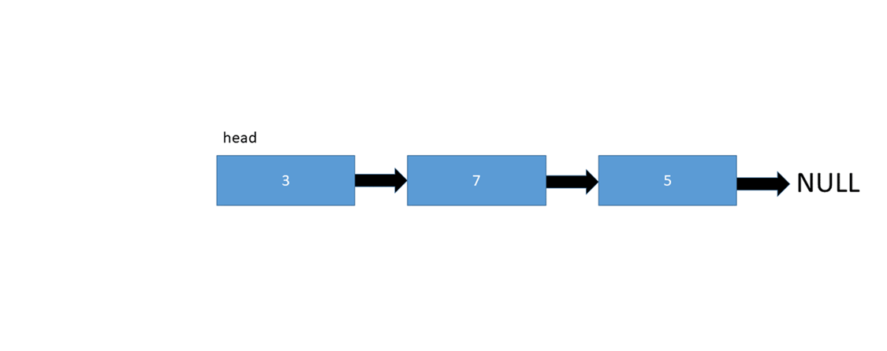
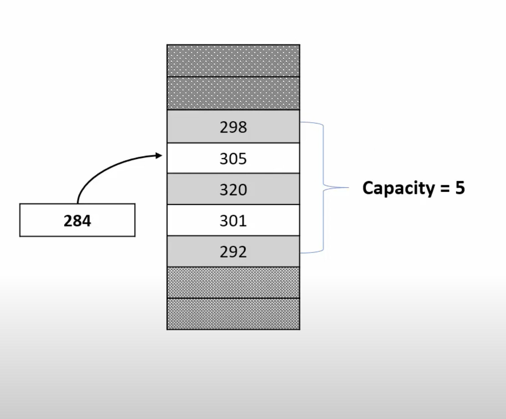
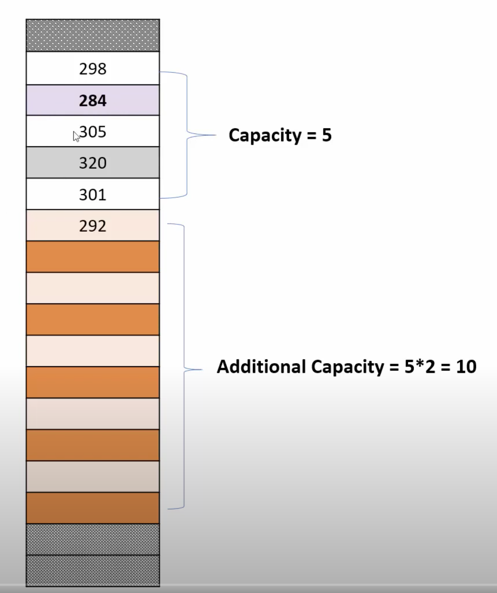
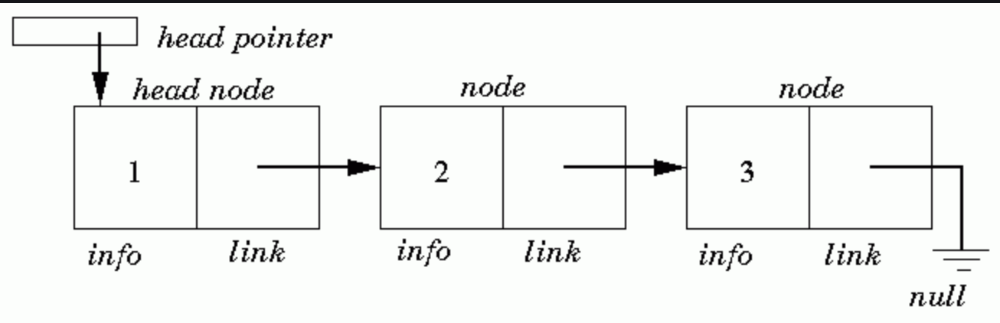
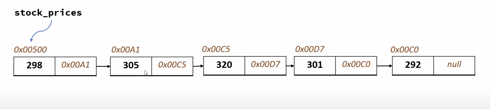

# Linked Lists


The full code can be [found here](https://github.com/369geofreeman/machine-learning-algorithms-and-data-structures/blob/main/Data-Structures/Linked-Lists/linked-list.py)

A collection of coding challenges involving linked lists can be [found here](https://github.com/369geofreeman/machine-learning-algorithms-and-data-structures/tree/main/Data-Structures/Linked-Lists/Examples)

#### Contents

* [Overview](#Overview)
* [Why Linked Lists?](#why-linked-lists)
* [What do they look like?](#what-do-they-look-like)
* [Strengths and Weaknesses](#strengths-and-weaknesses)
* [Big O Analysis](#big-o-analysis)
* [Building a Linked List](#building-a-linked-list)


### Overview



<span style="font-size: 11px !important;">gif: David Landu [stackabuse.com](https://stackabuse.com/)</span>


Linked lists are a great introduction to data structures and the use of pointers. Even if we don't use linked lists often, the use and understanding of pointers is something that is very common, and a powerful tool to understand.

Linked list problems are a nice combination of algorithms and pointer manipulation which is what we are going to dive into here.

Being a linear data struture, where elements are stored at non-contiguous locations, a linked list is like a chain made of nodes and the links are pointers. Pointers represent the address of a location in memory. Lets begin!


### Why Linked Lists?

First, it's a good to note that linked lists are very similar to arrays since they share collections of elements on behalf of "client" code.
The structure stores elements of any type so the specific type isn't important, infact as Nick Parlante put it "One way to look at linked lists is to look at how arrays work and think about alternative approaches"

Arrays are probably the most common data structure used to store collections of elements and although python uses lists, numpy provides a very popular way to use arrays that leverages c++ under the hood for speed. We will be refering to the numpy array for the rest of this article.

A quick look at arrays will help show the strengths of a linked list so that's what we we will do

An array allocates memory for all of it's elements as one block of memory heaped together. As seen below where we have an array with a capacity of 5.




Each element in the array gets it's own space in the array and can be accessed directly, usually using the [] syntax. 
Once the array is set up, accessing elements via the index like this "array[element]", is fast, in fact it is of O(1) notation.

This has some drawbacks though, More often than not, the size of the array is specified at compile time and fixed at runtime. Inserting new elements, especially at the front is expensive because we then need to shift all the elements to make room for the new one.
Insersion is of O(n) complexity.

A list in python is a dynamic array and when it's created, internally in memory, some capacity will be alocated. Once we are close to using up the allocated memory, the way dynamic arrays work is, due to the memory space around the allocated space being most likely used for something else, it will find a new space in the memory (ram) that can accommodate the new requirements with the additional capacity and copy all the elements over. 

This usually looks like this 
```
	additional capacity = original size capacity * 2
``` 
which will fit the new elements and any additional ones that might be needed. As you probably guessed, once this new space is almost full the cycle repeats and a new, bigger sppace is found etc.
The image below shows this




Now before we get into how a linked list does things different to the technique of an array, lets take a quick look at the definition of pointers.

A pointer stores a reference to another variable. If a pointer is not referring to anything we can expect it to be set as None.
A linked list allocates a space for each of its elements seperatly in memory, these are usually called "nodes" or sometimes the more creatively named... "linked list element"

Typically a node will contain the location/address of the next element that could be anywhere in the random access memory and points to this location, rather than being bunched together like we saw earlier with the array


The overall structure then can be viewed as nodes chained or... LINKED together. this is also the basis of many other data structures that we will cover in this repo like stacks, queues, trees etc.

### What do they look like?


The image below shows a linked list in its most basic form



* The "head" pointer local to the list keeps the whole list by storing a pointer to the first node
* The overall list is built by connecting the nodes together by their pointers
* Each node stores one data element, an integer in this example.
* Each node also stores one "next" pointer
* the "next" field of the last node is None indicating the end of the list

So whats happening is, at the beginning the linked list is stored in a head pointer which points to the first node in memory, the first node points to the second, the second to third and so on until we reach the last node which has its pointer set to None to indicate the end of the list.

We can see this in the image below



We can access any node in the list by starting at the head and following the ".next" pointers until we reach our target. This makes accessing an element O(n) complexity which compared to an array is not very good.


### Strengths and Weaknesses


|            | Array                              | Linked List                                                               |
|------------|------------------------------------|---------------------------------------------------------------------------|
|            | * Random access (fast search time) | * Fast insertion/ deletion time                                           |
| Strength   | * Less memory per element          | * Dynamic size                                                            |
|            | * Better cache locally             | * Efficient memory allocation distribution                                 |
| ---------- | ---------------------------------- | ------------------------------------------------------------------------- |
|            | * Slow insertion/deletion time     | * Slow search time                                                        |
| Weaknesses | * Fixed size                       | * More memory needed per node as additional storage required for pointers |
|            | * inefficient memory allocation    |                                                                           |


### Big O Analysis

|                              | Array | Linked List |
|------------------------------|-------|-------------|
| Cost of accessing elements   |  O(1) |     O(n)    |
| Insert/remove from beginning |  O(n) |     O(1)    |
| Insert/remove from end       |  O(1) |     O(n)    |
| Insert/remove from middle    |  O(n) |     O(n)    |


### Building a Linked List

[The full code can be found here](https://github.com/369geofreeman/machine-learning-algorithms-and-data-structures/blob/main/Data-Structures/Linked-Lists/linked-list.py)

To begin, we will initiate two classes:
* A Node class which represents an individual element in the list

```
 class Node:
	def __init__(self, data=None, next=None):
		self.data = data
		self.next = next
```
It has two elements, the data the node is holding and the pointer (next) to point to the next node or None if it's the last element.

* The second is the LinkedList class
```
class LinkedList:
	def __init__(self):
		self.head = None
```
This holds the head variable which points to the head of the linked list.

Right now, as you probably guessed, our linked list is quite useless as it can't do anything yet. So let's add some methods to power this bad boy up.

The first, and probably most obvious method we should implement will be an append method so we can add items to our list
```
	def append(self, data):
		newNode = node(data)
		currentNode = self.head
		
		while currentNode.next != None:
			currentNode = currentNode.next
		currentNode.next = newNode
```

First we add the data object to the Node class creating a new instance of the class Node holding the data, then we itterate through the nodes using the ".next" pointer to get to each next one until we reach the end where we finally add our new node.

This method is key to many ways we can manipulate our linked list. To find the length we can itterate in the same way counting on each itteration and returning the total.
If we want to display all the items we can print them out on each itteration and so on.

To see a collection of such methods in a working code example [click here](https://github.com/369geofreeman/machine-learning-algorithms-and-data-structures/blob/main/Data-Structures/Linked-Lists/linked-list.py)
 
To see a  collection of coding challenges involving linked lists [click here](https://github.com/369geofreeman/machine-learning-algorithms-and-data-structures/tree/main/Data-Structures/Linked-Lists/Examples)


