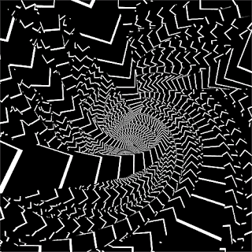

# Recursion


### Code for the following problems can be [found here](https://github.com/369geofreeman/tutorials-and-compititions/blob/main/dynamic_programing/recursion/recursion.py)

  * Sum all the numbers up to n
  * Traverse an m by n grid
  * Count number of ways to partition an object using up to n parts
  * Array Sum
  * The Fibonacci Number
  * Combinatorial Exploration
  * Minnimum swaps from one binary to another

### Contents
  * [5 Steps to Solving a Recursion Problem](#5-steps-to-solving-a-recursion-problem)
  * [Traversing an m by n grid](#traversing-an-m-by-n-grid)
  * [Count partitions](#count-partitions)


## 5 Steps to Solving a Recursion Problem


## Step 1

_**"Find the simplest possible input"**_


Given the following problem:

_Find the sum of all non negative integers up to n_


Solving this problem recursivly, the first step is to find the simplest possible input. 
This usually becomes the base case for a recursive problem. **A base case is the only time we provide an explicit answer to a recursive problem** and all other solutions to the problem will build on the base case


## Step 2

_**"Play around with examples and visualise"**_


For the same problem as before **_Find the sum of all non negative integers up to n_**, we could visualise this with each integer representing the base blocks of a triangle. That was our output in the total number of blocks in this triangle, like so:
```
	n=1	n=2	n=3		n=4		n=5
							*
					*		**
			*		**		***
		*	**		***		****
	*	**	***		****		*****

	1	(1+2)   (1+2+3)		(1+2+3+4)	(1+2+3+4+5)
	=1	  =3	  =6		   =10		    =15
```

## Step 3

_**"Relate larger examples with smaller examples"**_


As we can see from the step above, the triangles of the smaller numbers can also be found in the larger triangles. 

For instance, if we was given the answer for n=4, could we then solve n=5 easier by looking at our visulisations?

Of course. we can simply use n=4 and add a new base to it, creating an n=5 case which results in 15. This will work with any n as long as it is smaller than the number we are trying to get to

Likewise, we can get the previous number by removing the current base from n. If n = 4 and we want n=3, we can simply remove the base of n=4 leaving us with n=3, which is 3.


## Step 4

_**"Generalise the pattern"**_

Now we have found a pattern in step 3, we can generalise it to find a definite answer. If we use the same problem as before, we can say that n=k. 

Now we can take the sum of n=k-1 and just add k to this value. For instance, if k=5 we would get the result for k=4, which is 10 and add 5 which gives us 15, the correct answer.
 
## Step 5

_**"Write code by combining the recursive pattern with the base case"**_
 

So given the previous steps we can now solve our problem with some code

Remember the problem was **_Find the sum of all non negative integers up to n_**.

First we define our function
```
def add(n):
```

Next we find our base case. The simplest possible input would be 0, that can be our base case
```
def add(n):
    if n == 0:
        return n
```
Then we add the numbers that are in n by calling the function recursively if n != 0
```
def add(n):
    if n == 0:
        return n
    else:
        return n + add(n-1)
```


# Traversing an m by n grid

Now we can use this logic to solve the following problem

_**"Write a function that takes two inputs n and m and outputs the number of unique paths from the top left corner to the bottom right corner of the m*n grid."**_

_**"Contraints: You can only move right or down one unit at a time"**_


First lets define the function
```
def path(n, m):
```

So using our steps we first want to find the most basic case. Here it would be if either m or n was 0. if either of them are equal to 0, it means we have no grid so the answer is 0.
```
def path(n, m):
    if m == 1 or n == 1:
        return 1
```
Likewise, if we have a result that is equal to (1,1). we know that it cant move any further so we terinate the function.
```
def path(n, m):
    if m == 1 or n == 1:
        return 1
    else:
        if m == 0 and n == 0:
            return 0
```

Next we want to visualise the problem. Given that we can only move right or down, we can visualise this as a tree structure.
Say that:
*  m = 2
*  n = 3

We could view it like this
```
         (2,3)
        /     \    
     (1,3)     (2,2)
    /   \      /    \
(0,3) (1,2)  (1,2)   (2,1)
      / \     /  \     /  \  
 (0,2)(1,1)(0,2)(1,1)(1,1)(2,0)
```

Now looking at this tree we can start to see a pattern in the branches. For examples the branches that start with (1,2) will have the same children. and the inverse of that (2,1) will have the same inverted children.

We can use this info to visualise the routes. Looking at the leaves containing the results (1, 1), which we know to be the last step one can take, we can count these leaves and see that there are 3 possible paths to the bottom right for a 2 times 3 grid where we can only move down or to the right, one unit at a time.

So lets add that into our code

```
def path(n, m):
    if m == 1 or n == 1:
        return 1
    else:
        if m == 0 and n == 0:
            return 0
        return path(n-1, m) + path(n, m-1)

```

and there we have the full code. Each step will reveal another unit moved along towards the end goal.


# Count partitions

_**"Write a function that counts the number of ways you can partition n objects using parts up to m"**_

_**"Constraints: m, n >= 0"**_


Now we will write a recursive solution to find the number of ways we can partition n objects using parts up to m. 

First we define the function
```
def partitions(m,n):
```
The base, or worst, case for this will depend on m and n. For instance, if m is equal to 0 we will always get a return of 1 because partitioning nothing by any number will give us the count of one partition, the partitiion that found there is no object

However, if n is equal to 0 we will get a return of 0. This is because if there are no partitions, there will be nothing to count, hence 0.

We can add these bases cases to our function like so.
```
def partitions(m,n):
    if m == 0:
	return 1
    if n == 0:
	return 0
```


we can visulise this problem easy due to it being the different ways we sum up numbers, like so:
```
	m = 5, n = 3

 - 3 + 2
 - 3 + 1 + 1
 - 2 + 2 + 1
 - 2 + 1 + 1 + 1
 - 1 + 1 + 1 + 1 + 1 
```

And now we can use this structure to look for patterns in the data

for instance, if we use the two examples of (7,4) and (7,3)

which looks like this
```
	m = 7, n = 4 			m = 7, n = 3

	4 + 3				3 + 3 + 1
	4 + 2 + 1			3 + 2 + 2
	4 + 1 + 1 + 1			3 + 2 + 1 + 1 + 1
	3 + 3 + 1			3 + 1 + 1 + 1 + 1 + 1 + 1
	3 + 2 + 2			2 + 2 + 2 + 1 
	3 + 2 + 1 + 1 + 1		2 + 2 + 1 + 1 + 1
	3 + 1 + 1 + 1 + 1 + 1 + 1	2 + 1 + 1 + 1 + 1 + 1
	2 + 2 + 2 + 1			1 + 1 + 1 + 1 + 1 + 1 + 1
	2 + 2 + 1 + 1 + 1
	2 + 1 + 1 + 1 + 1 + 1
	1 + 1 + 1 + 1 + 1 + 1 + 1
```

It becomes obvious that the entirety of the partitions of 7,3 are also in the partitions of 7,4. I(7,3) is a subset of (7,4)

And this can be represented in our recusion function. We will use them as the subset + m to get the next step in our recursion
Put more simpily, (n-m,m) + (n,m-1) will give us our next step


Let's add this to our code

```
def partitions(m,n):
    if n == 0:
	return 1
    elif m == 0 or n < 0:
	return 0
    else:
	return partitions(n-m,m) + partitions(n,m-1)

```

Which turns out to be a very elegent solution to the problem.




