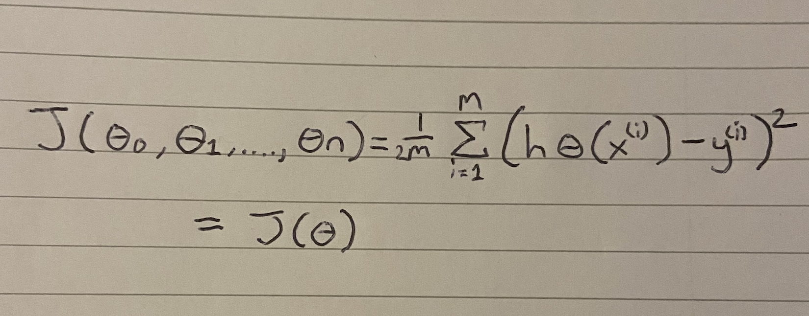
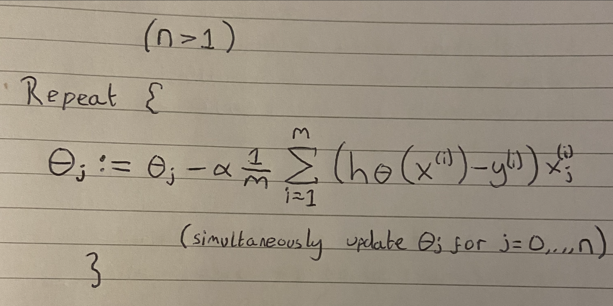
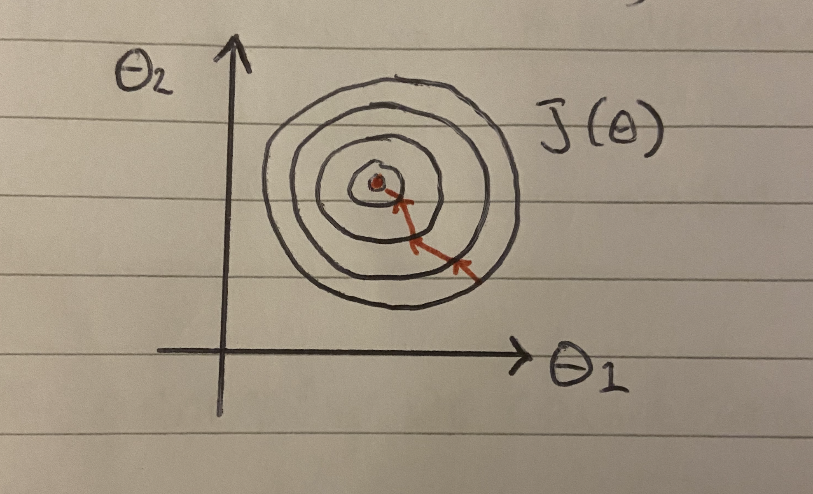
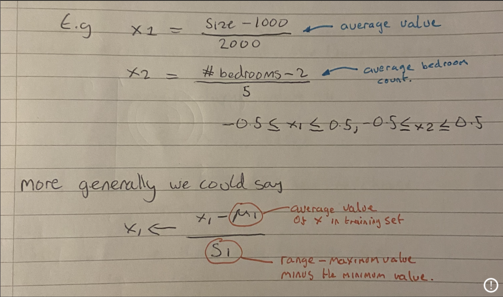
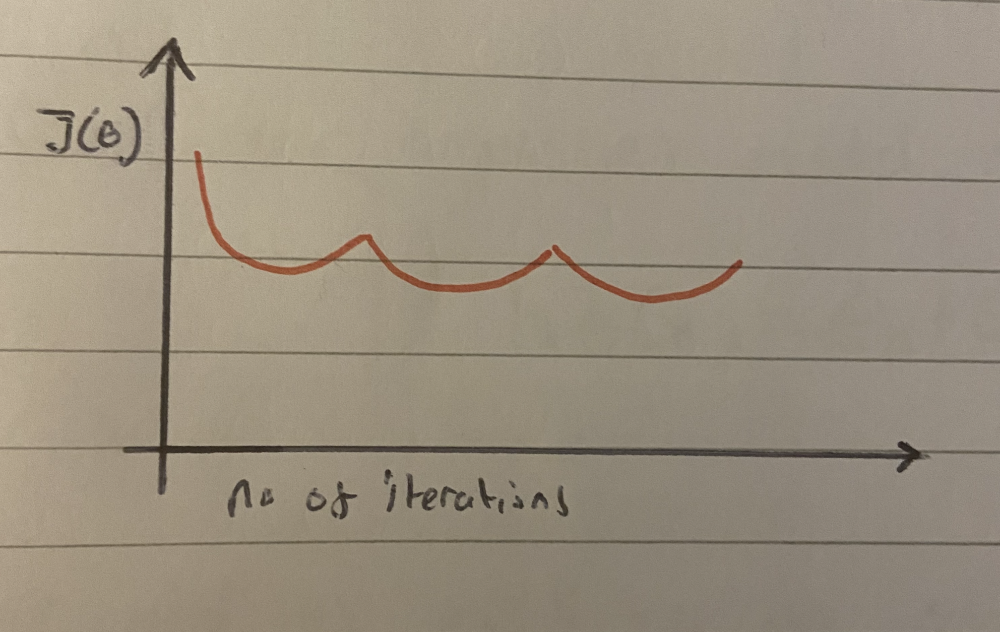
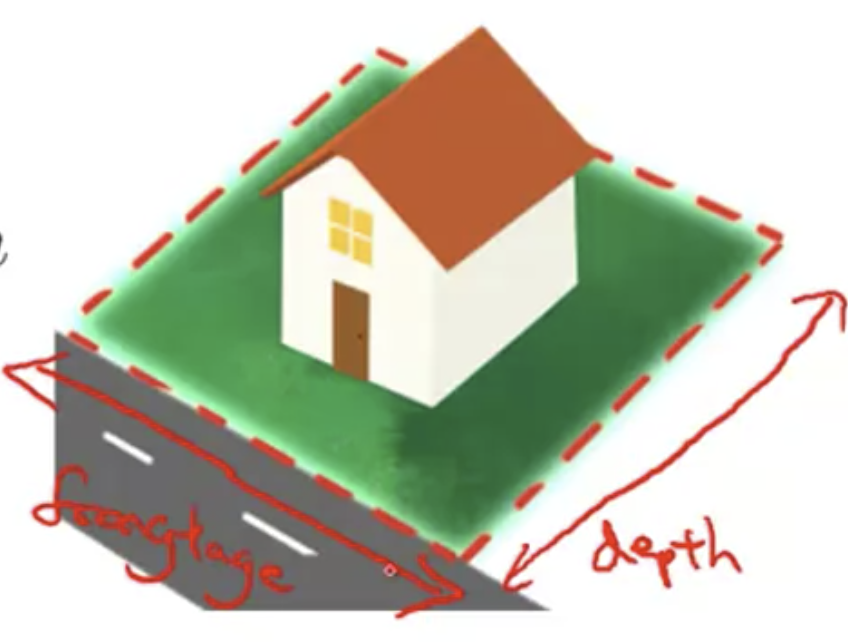
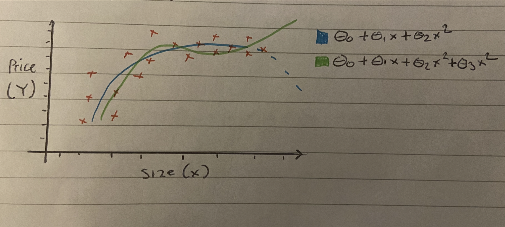

# Linear Regression with multiple variables

**Code implementations of the functions discussed below**

- [Code Implementations](#code-implementations)

#### Contents

- [Recap of linear regression with a single variable](#recap-of-linear-regression-with-a-single-variable)
- [Notation](#notation)
- [Hypothesis](#hypothesis)
- [Gradient decent for multiple variables](#gradient-decent-for-multiple-variables)
- [Feature scaling](#feature-scaling)
- [Learning rate](#learning-rate)
- [Features and polynomial regression](#features-and-polynomial-regression)
- [The normal equation](#the-normal-equation)

### Coding Examples

- [Linear Regression multi variable code walkthrough](https://github.com/369geofreeman/machine-learning-algorithms-and-data-structures/blob/main/Machine-Learning-Algorithms/Regression/linear-regression-multiple-variable/linear-regression-multi.py): An implimentation using sklearn where we check to make sure the math is correct
- [Using incomplete data sets](https://github.com/369geofreeman/machine-learning-algorithms-and-data-structures/blob/main/Machine-Learning-Algorithms/Regression/linear-regression-multiple-variable/salary_decider.py) An implimentation where we predict the salary for a new employee uisng an incomplete traning set

### Recap of linear regression with a single variable

In single variable linear regression we had a single feature x, the size of the house, and we wanted to predict the price of that house using this training data

| Size (feet)^2 x | Price ($1000) Y |
| :-------------: | :-------------: |
|      2104       |       460       |
|      1416       |       232       |
|      1534       |       315       |
|       852       |       178       |
|       ...       |       ...       |

Whre x is the single vector of size inputs and y is the price (prediction) outputs

Our hypothesis for this looked something like this:

```
	h𝜣(x) = 𝜣₀ + 𝜣₁x
```

But now we want to use more features to help us get a more accurate prediction of the price.
Instead of just the size, we can add more features for a better understanding of what makes the price what it is. These can include 'number of rooms', 'age of home', 'number of floors' etc. Lets look at how the notation will be used for this.

### Notation

Each feature we use will be denoted as a subscript of x:

- x1 = Size (feet)²
- x2 = Number of rooms
- x3 = Number of floors
- x4 = Age of house

Like with single variable linear regression, y will be the variable (price) we are trying to predict.

This all looks something like this

| Size (feet)^2 (x1) | Number of bedrooms (x2) | Number of floors (x3) | Age of home (years) (x4) | Price ($1000) Y |
| :----------------: | :---------------------: | :-------------------: | :----------------------: | :-------------: |
|        2104        |            5            |           1           |            45            |       460       |
|        1416        |            3            |           2           |            40            |       232       |
|        1534        |            3            |           2           |            30            |       315       |
|        852         |            2            |           1           |            36            |       178       |
|        ...         |           ...           |          ...          |           ...            |       ...       |

**So now the full notation will be:**

- m = Number of traning examples
- n = Number of features
- x = 'input' variable/feature
- x⁽ⁱ⁾ = 'input' features of ⁱth example
- x𝑗⁽ⁱ⁾ = Value of features 𝑗 in ⁱth traning example
- y = 'output' variable/target variable

For instance:

```
	     |1416|
	x² = |  3 |
	     |  2 |
	     | 40 |
```

And:

```
	x₂¹ = 1416
```

### Hypothesis

Previously with single variable linear regression, our hypothesis looked like this:

```
	h𝜣(x) = 𝜣₀ + 𝜣₁x
```

where x was our single feature vector.

Now we are using multiple features, our hypothesis will look like this:

```
	h𝜣(x) = 𝜣₀ + 𝜣₁x₁ + 𝜣₂x₂ + 𝜣₃x₃ + 𝜣₄x₄
```

And if we have n features, we would have the sum of n features instead of 𝜣₀ + 𝜣₁x₁ + 𝜣₂x₂ etc

For a solid example, if we have:

```
	h𝜣(x) = 80 + 0.1x₁ + 0.01x₂ + 3x₃ - 2x₄
```

So what this is showing is that 80 (thousand) might be the base price for a house and then plus 100 (x₁) dollars per square foot, plus 10 dollars (x₂) per floor, plus 3 (thousand) x₃ for the 3 extra bedrooms and finally the price goes down -2 (thousand) x₄ for each year it's aged.
Summed together we will get our prediction for the price of the house

For convenence we can simplify our hypothesis. At the moment it looks like this for an n sized hypothesis:

```
	h𝜣 = 𝜣₀ + 𝜣₁x₁ + 𝜣₂x₂ + ,..., 𝜣𝒏x𝒏
```

Now if we add a feature x₀ to our x's that is equal to 1, so x₀=1, then we can transpose our matrix like so:

```
	    |x₀|	      |𝜣₀|
	x = |x₁| ∈ℝⁿ⁺¹    𝜣 = |𝜣₁|
	    |∶∶|	      |∶∶|
	    |x𝒏|	      |𝜣𝒏|
```

And because they are the same size now:

```
	[𝜣₀,𝜣₁,...,𝜣𝒏]|x₀|
		      |x₁|
	 	      |∶∶|
		      |x𝒏|
```

Our hypothesis can now look like this

```
	h𝜣(x) = 𝜣₀x₀ + 𝜣₁x₁ + ,..., 𝜣𝒏+x𝒏
```

Which can be simplified to this minimal version

```
	𝜣ᵀx
```

This allows us to do matrix operations with 𝜣 and x very easily

### Gradient decent for multiple variables

Lets quickly review what we have so far:

- Our hypothesis: 𝜣ᵀx = h𝜣(x) = 𝜣₀x₀ + 𝜣₁x₁ + ,..., 𝜣𝒏+x𝒏
- Parameters: 𝜣 which is an n⁺¹ dimensional vector
- And our cost function which you will remeber as:



- Gradient decent:

We repeatedly update each parameter of 𝜣𝑗 according to 𝜣𝑗 minimum alpha times the derivative term:

```
	𝜣𝑗 := 𝜣𝑗 - 𝞪 𝟃/𝟃𝜣𝑗 J(𝜣₀,...,n)
```

(Simultaneously update for every j = 0,....,n). Of course we can also rewrite this one as J(𝜣) like so:

```
	𝜣𝑗:= 𝜣𝑗 - 𝞪 𝟃/𝟃𝜣𝑗 J𝜣
```

Lets see what this looks like when we implement gradient decent and what that 𝟃/𝟃𝑗 (partial derivative) looks like.

previously when we only had one feature vector, our gradient decent looked like this, where n=1


But now we have n features so our algorithm looks like this



### Feature scaling

Now lets see this in practice.
Here's the idea; Because we have more features now, making them converge can get expensive so we need a way to scale them down into a range that is smaller yet holds the same equivilant percentages between them.

For instance, lets say we have a problem that has two features:

- x₁ = Size of the house(0-2000 feet²)
- x₂ = number of bedrooms (1-5)

now if we plot the contors of the cost function J(𝜣) then they might look something like this


You can see the contors take on this skewed eliptical shape because of the large 2000-5 ratio which can be caused by the big range of x₁ and small range of x₂

If we were to run gradient decent over this, it would take a very long time to converge due to it oscillating back and fourth before finding the global minimum, as seen by the red line in the image above.

So what can we do? Well, we can scale the features so they fit on a much smaller scale while still being a relevant distance between each other, for instance between -1 +1

We could define features of our x₁ and x₂ like this. If we take x₁ and divide it by the max feet size from our range, so 2000, and define x₂ to be the number of bedrooms divided by 5 (the max number of rooms). So if we have a house size of 1600, we divide it by 2000 to get 0.8 which fits nicely between -1, +1. and if we have 3 bedrooms, we divide them by 5 to get 0.6 which is also a good fit.

This will cause the contours to be far less skewed and take on a more circular shape, thus making finding the the golbal minimum much more easy as seen in the image below



In this case we made all the features fit between 0-1 which gave us an implentation of gradient decent that converges much faster.

More generally, when performing feature scalling we would like to get every feature in the range -1 +1. since our features x₀ is already equal to 1, this fits nicely.

There are many different ways to get our features into the -1 +1 range and we will explore these further in this repo.

It's also good to note that the specific numbers -1 +1 and not important, whats important is we have our features close together. If we had features scalled to say, -4 -6 for instance, or -1 2, that would be fine too as they are of a similar close range.

Another option is to use mean normalisation.
What this does is take your xᵢ feature and replace it with μ to make the features have approximately zero mean. Obviously we wont apply this to x₀=1



One final example to find the feature scale.

Our learning algorithm is to estimate the price of a house in the city. If we have a feature xᵢ that we want to capture the age of the house. All the houses in our training set have an age of 30-50 years, with an average of 38 years
Using mean normalisation and feature scaling we can use

```
	     age of house - 38
	xᵢ = -----------------
		   20

Where 38 is the average age
20 is the difference in ages between the house range
```

If our house was 36 years old , then this equation would give us -0.1 as a result which fits nicely between -1 ans +1

### Learning rate

Now lets look into another method to get gradient decent to work efficiently, the learning rate alpha (𝞪)

Here is the gradient decent update rule

```
	𝜣𝑗 := 𝜣𝑗 - 𝞪 𝟃/𝟃𝑗 J(𝜣)
```

And we are going to learn how to choose the learning rate 𝞪

First, here is a way to make sure gradient decent is working correctly.
The job of gradient decent is to find a value of 𝜣 that minimises the cost function J(𝜣)

```
	min J(𝜣)
	 𝜣
```


If our gradient decent is working correctly, then our J(𝜣) should be decreasing after every iteration

Another thing that's useful that this can tell us, is as the values of the J(𝜣)'s level out or show little to no change, then we know that our gradient decent has more or less converged.

The rate of iterations can vary by a lot depending on our data, so plotting this can help to visualise when we converge.

We can also run an automatic convergence test, an algorithm to tell us if gradient decent has converged. A typical example might be to see if J(𝜣) decreases by less than 10⁻³ in one iteration. Although this can somettimes be difficult, so generally we should rely on the plots like above

Obviously gradient decent isn't working if we get results like below


in this case we should try a smaller 𝞪. A common cause for this might be if we are trying to minimise a function and the learning rate is too big, then gradient decent might over shoot the minimum and start to increase instead

Another failed gradient decent might look like this



The same fix of using a smaller 𝞪 can be applied here also.

The general rule of thumb is:

- For a sufficiently small 𝞪, J(𝜣) should decrease on every itteration
- But if 𝞪 is too small, gradient decent can be slow to converge.

A good set of learning rates to try is:

```
	0.001 -> 0.003 -> 0.01 -> 0.03 -> 0.1 -> 0.3 etc
```

So we are increasing by three fold then up 10 from the original value.

### Features and polynomial regression

First lets talk about the choice of features we have and how we can get different learning algorithms by choosing the appropriate ones.

For example, lets take the example of predicting the price of a house.
We have two features, the frontage of the house and the depth of the house.

Heres a picture of a lovely house showing this:



The frontage will be defined as the width of the house and the depth will be how deep the property is.

Our linear regression model will look like this:

```
	h𝜣(x) = 𝜣₀+𝜣₁xfrontage + 𝜣₂xdepth

Where frontage is x₁ feature
and depth is x₂ feature
```

Our features x₁ and x₂ are shown here as the frontage and depth, but we are not limited to just those. We can actually create new features, but how?

Well, for instance we might decide the area is more important to sell this house, so we instead create a new feature called area:

- area = frontage \* depth

And now we can select our hypothesis as a single feature h𝜣(x) which is:

```
	h𝜣 = 𝜣₀+𝜣₁x

(x is the area)
```

Basically if you have an insight into a particular problem, you can use the current features you have to create new and hopfully more relivant features to solve your problem.

Closely related to this is.....

### Features and polynomial regression

Say we have a houseing price data set that looks like this



As you can see, a straight line might not be the best fit for this data so we might do is fit a quadratic model. We can see this in the blue line above

```
	𝜣₀ + 𝜣₁x + 𝜣₂x²
```

Although this still might not work because the quadratic model will eventually curve down as it continues. Obviously as the size of houses go up, the price generally doesn't go down so this isn't good in this case.

Another model we could try is the cubic model (as shown by the green line above), this is a better fit for the instance of house prices.

But how do we choose a good model ?

Using the machinery of multivariant linear regression we can do this with a pretty simple modeification to our algorithm

With our hypothesis we know the fit looks like this

```
	h𝜣(x) = 𝜣₀+ 𝜣₁x₁ +𝜣₂x₂ + 𝜣₃x₃
```

and if we want to fit this cubic model we apply it like so

```
	= 𝜣₀ + 𝜣(size) + 𝜣₂(size)² + 𝜣₃(size)³
```

and to map this to our hypothesis we set:

- x₁ = (size)
- x₂ = (size)²
- x₃ = (size)³

So applying our three features this way and applying the machinery of linear regression, we fit this model and end up with a cubic fit to our data. Obviously using this example we can fit any model to our data that we think will work well

Lastly, if we do choose our features like this, it's important to note that feature scaling becomes increasingly important.
For instannce if our size ranges from 1-10000 then

- size² ranges from 1- 1000,000
- size³ ranges from 1 - 10⁹

So it can quickly get large and out of control.

### The normal equation

The normal equation is an analytical approach to linear regression with a least square cost function

We can directly find out the value of 𝜣 without using gradient decent. Following this approach is an effective and time-saving option when we are working with a dataset with small features

**The equation looks like this**

```
	𝜣 = (xᵀx)⁻¹.(xᵀy)
```

The advantages against the disadvantages are as follows:

| Gradient Decent                    | Normal Equation            |
| ---------------------------------- | -------------------------- |
| \* Need to choose alpha            | \* No need to choose alpha |
| \* Needs many iterations           | \* Don't need to iterate   |
| \* Works well even when n is large | \* Need to compute (xᵀx)⁻¹ |
|                                    | \* Slow if n is large      |

The rule of thumb is to use a normal equation iif n < 10,000/50,000 otherwise it's probably safe to say we will use gradient decent.
