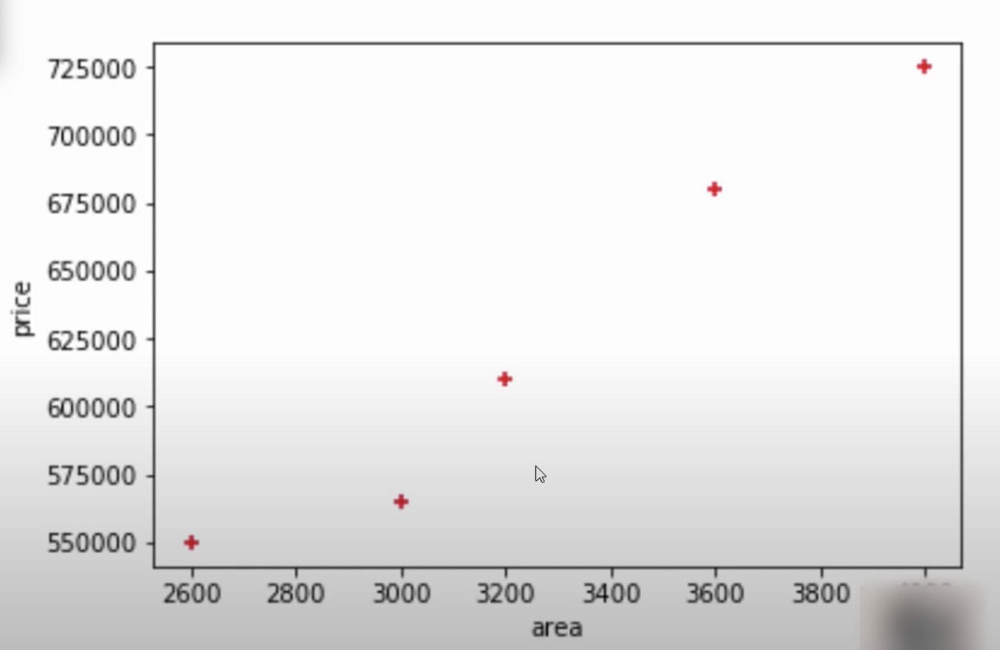
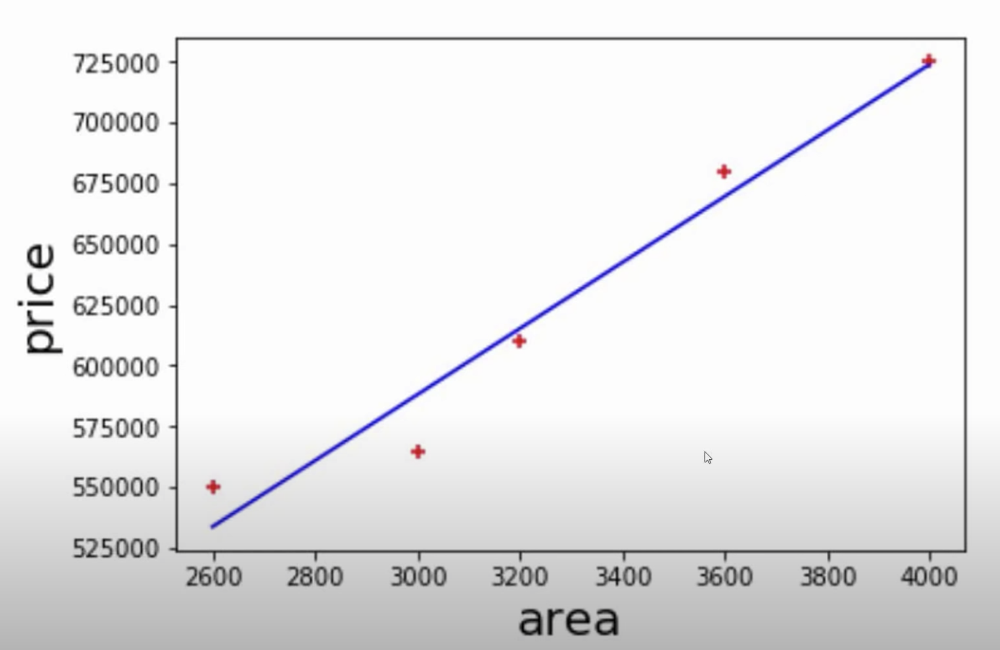
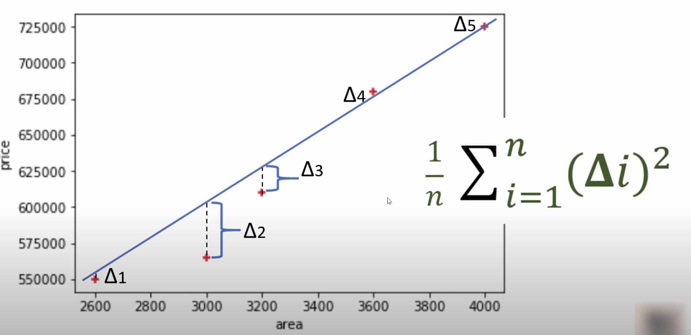
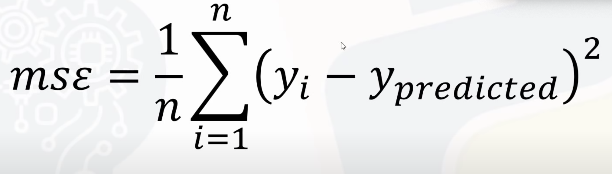
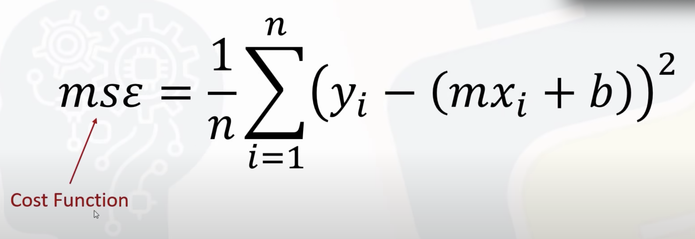
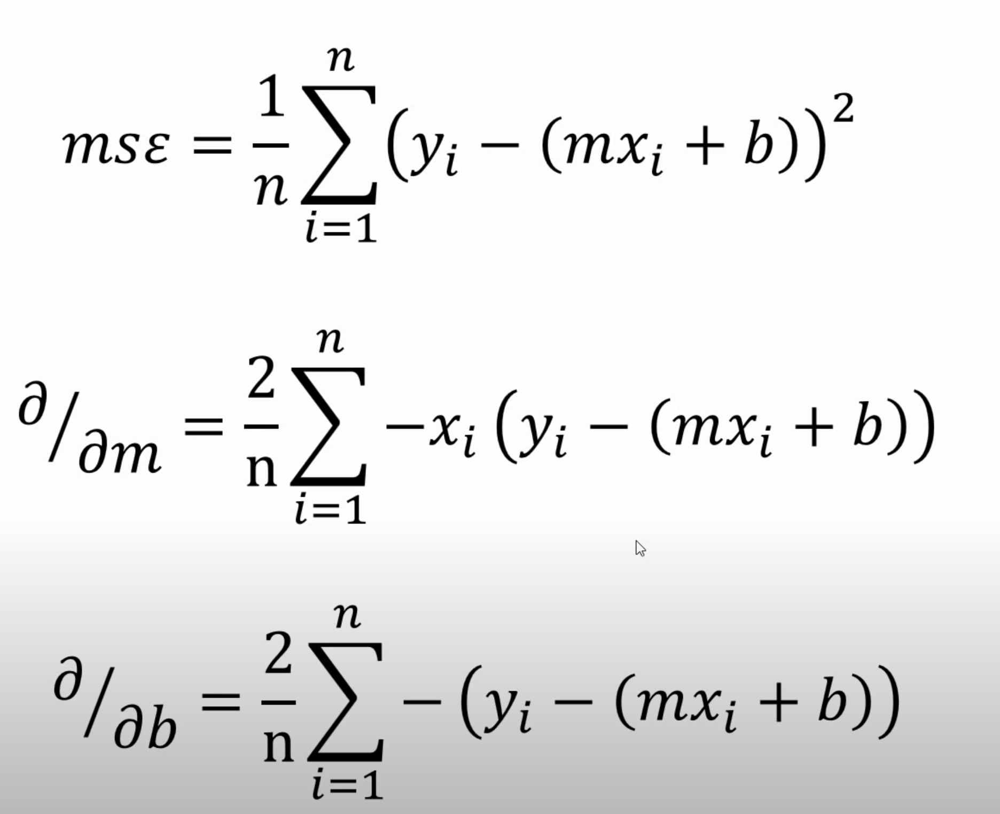
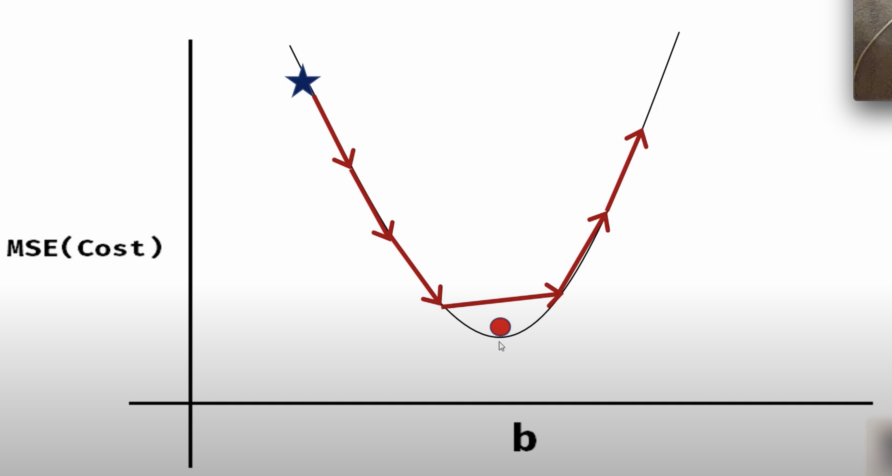
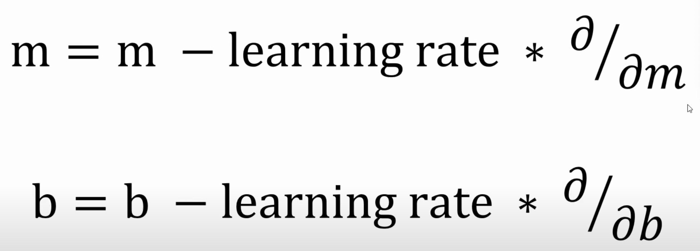
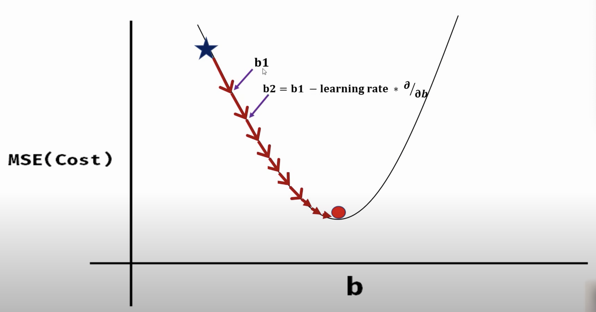
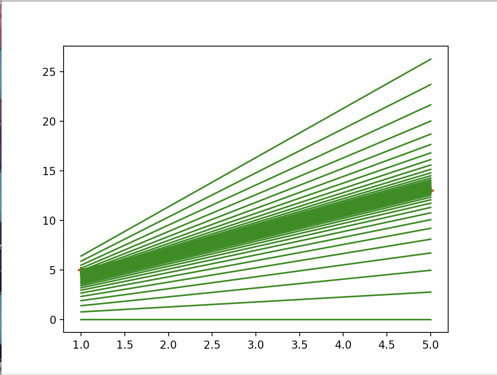

# Gradient Decent and the cost function


**Gradient decent is an algorithm that finds the best fit line for the given data set**


To explain gradient decent we will use classic example of predicting house prices.

To start, the dat we will use will be a modest set of five houses: The area and the price, as shown below

| Area | Price  |
|------|--------|
| 2600 | 550000 |
| 3000 | 565000 |
| 3200 | 610000 |
| 3600 | 680000 |
| 4000 | 725000 |



The input is the area and the output is the price. we want to our gradient decent algorithm to find the equasion that maps the input to the output.

That equasion looks like this:
```
input = [2600, 3000, 3200, 3600, 4000]
output = [550000, 565000, 610000, 680000, 725000]
equasion = (155.78) * (area + 180616.43)
```

The equasion is nothing but the blue line on the graph below which is known as the best fit line. It basically sits as best it can over all our data points

 

### How we find the line of best fit

One method is to start with a random line and measure the distance (error) between each data point and the data point predicted by your line



The equasion above will calculate this for us.


So we collected all the data points and we squared them, but why?

The reason is some of the data points might be negative, if you were to simply add them up instead of squaring them the results could be skewed.

Once we have squared them we sum them all up and the result is the "Mean Squared Error" which looks like this 



Mean squared error is each of our data points minus the predicted data points from oure line of best fit squared. You sum them all up and divide them by n.

**Mean squared error** is... a **Cost function** wooo!, Now we are getting somewhere! Although it's good to note that it isn't the only cost function, there are many varieties but it is just a very popular one and we will cover more in this repo over time. 

Anyway, as mentioned before, **Gradient Decent is an algorithm that finds the best fit line for given data sets.**

 

Notice how we replace (Y_i - Y_predicted) with (Yi - (M_xi + b)), the equasion for a line as you remember. This is to get the direction towards our data point which we will do with step sizes. First though we need our direction.


To get this we will find the partial dirivative of m and b, that will  get the direction of our line.



Now we have found our partial derivatives, we now have the direction of the line towards our data point.

Remember, the idea is to find the slope at each given step towards the data point.


One thing we need to be wary of is if the steps are too big, if thats the case we might miss our data data point as seen below



Each step gives us the direction and the slope.
To calculate the step size we use something called the learning rate.



For example on the graph below we are at (b1) and we want to gewt to (b2).
We get there by subtracting the learning rate multiplied by the dirivatives from (b1)



So using all of this for example, and we started with the arrays:
```
input = [1, 2, 3, 4, 5]
output = [5, 7, 9, 11, 13]
```
We would, as a result of our gradient decent algorithm, find that m = 2 and b = 3. Which, using the formular mx+b=y is correctly mapping our inputs to our outputs.

And as proof that the inputs are mapped to the outputs we can calculate:
 
m = 2
b = 3

So:
```
2*1+3 = 5
2*2+3 = 7
2*3+3 = 9
2*4+3 = 11
2*5+3 = 13
```

Here is the Algorithm with each iteration shown on our graph


 

[The code can be found here](https://github.com/369geofreeman/machine-learning-algorithms-and-data-structures/blob/main/Machine-Learning-Algorithms/gradient-decent/gradient-decent.py)
