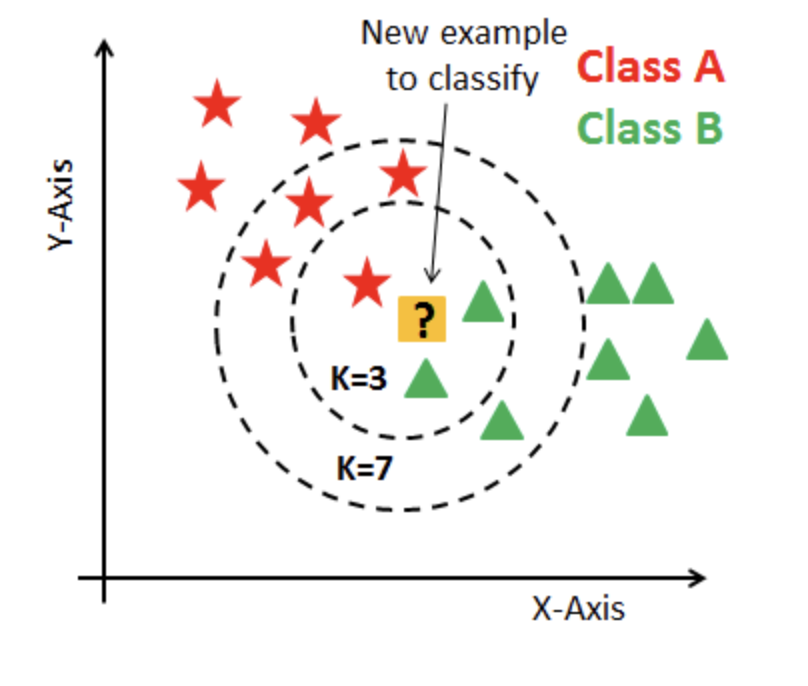
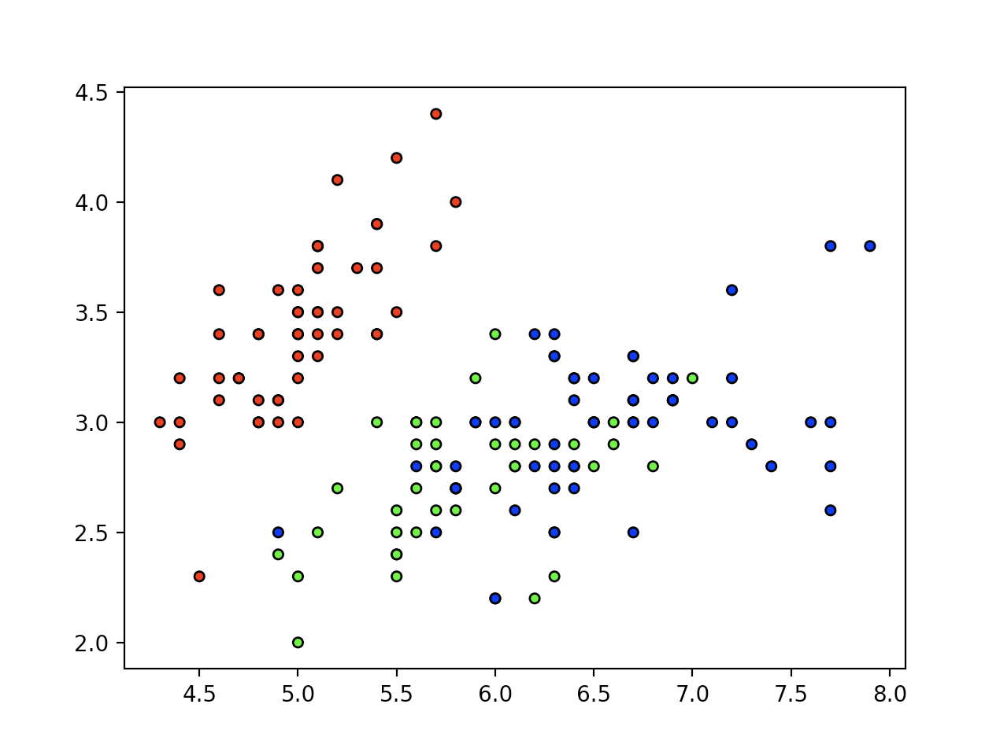
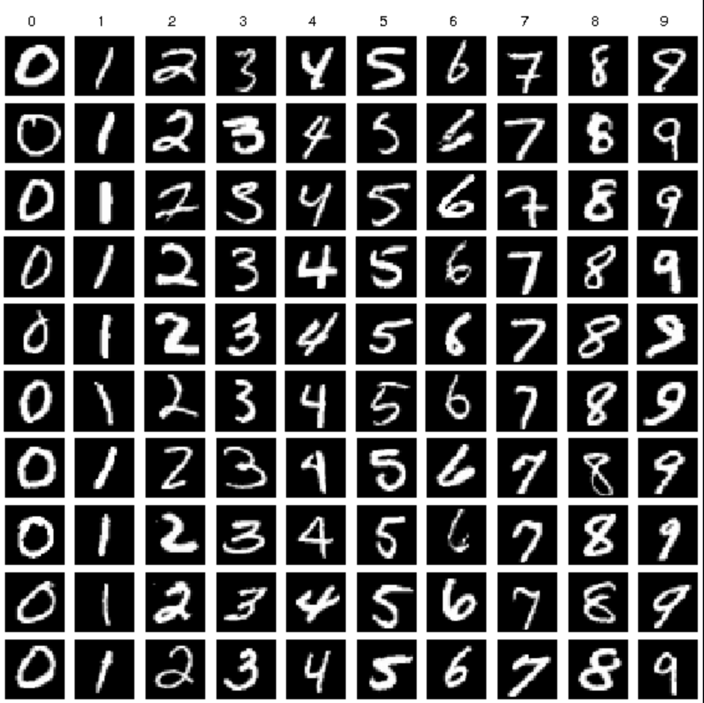
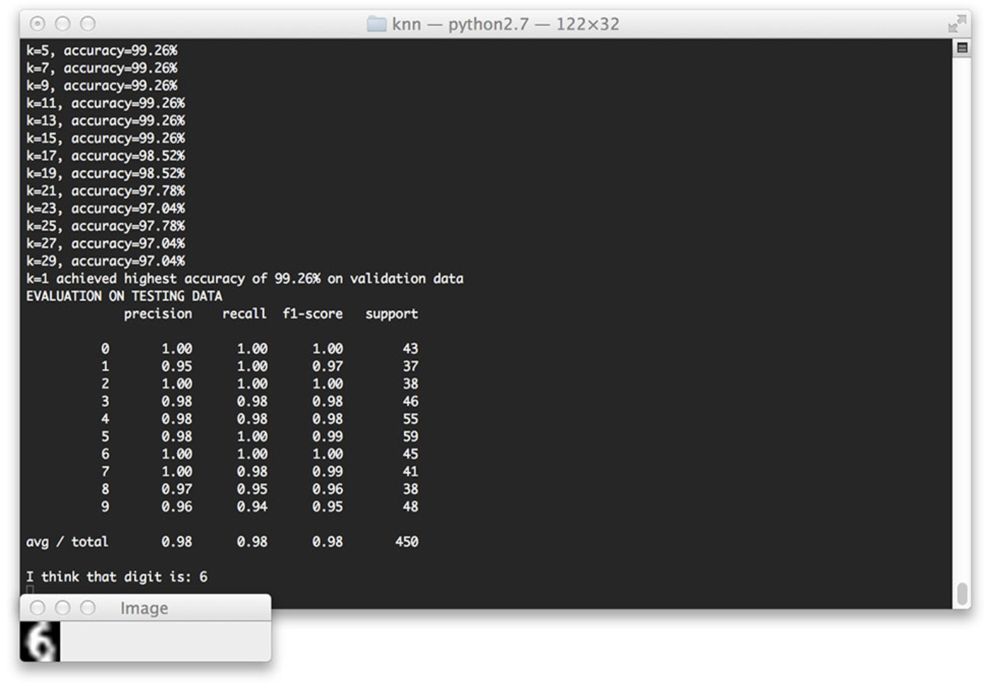

# K-Nearest Neighbours


### Code

  ---


## Contents
  * [Overview](#overview)
  * [Algotithm](#algotithm)
  * [Distance](#distance)
  * [KNN From Scratch](knn-from-scratch)
  * [Advantages and Disadvantages](#advantages-and-disadvantages)
  * [Applying KNN to the MNist Dataset](applying-knn-to-the-mnist-dataset)

## Overview


k nearest neighbor (Knn) is a simple classification algorithm that belongs to the family of instance-based learning, or lazy learning methods. 
This means that it doesn't use traning data points to make genralisations, meaning the training phase is very minimal or more commonly, non-existant which makes it very fast.

A drawback of this is the learning data is kept for testing, which can be expensive to compute given large data sets.
Knn works by finding similarities in the data. It's concidered a clustering algorithm based on the idea that samples that are close with respect to a predefined distance metric are also similar



In the above image we have binary data set consisting of red stars and green triangles. The data point we are trying to classify is in the middle. We can see the closest 3 data points or closest 7 data points to the data point we are trying to classify represented with the dotted lines.

Knn also doesn't make any assumptions on the underlying data distribution. Ie, it's non parametric. 
This can be very useful and is one of the main strengths Knn has. In the real world, practical data tends not to obey the typical theoretical assumptions made (eg gaussian mixtures, linearly seperable etc). So a non parametric algorithm can be very useful here

We can expect to find k nearest neighbor used for text categorisation (as will see later) or text mining as a popular use case but it is used in a wide variety of instances. For example in agriculture for the evaluation of forest inventoring, forecasting the stock market / trading futures in finance and various medical practices. 

Lets see how it works


## Algotithm

K nearest neighbor is actually a very simple algorithm. Basically, given N traning vectors, Knn identifies the K nearest neighbors of 'c' regardless of labels


Here we can see 'c' as our data point we are trying to classify, either it will be a red x or a green circle

Now firstly, we need to set K to a fixed number so we know how many neighbors we want to visit and compare 'c' to. 
We will usually set K to an odd number to avoid an even number of data sets which could create a tie leaving us witout a definite answer as to wht to classify 'c' as. 

So it basically works like this. If, for instance K=5, we will visit the 5 closest points (circled below)


For the above image, we can see there are 4 red x and 1 green circle that fall into the range of K nearest neighbors (given K=5).

So given this, 'c' is most likely a red x and will be classified as one.

Now the next logical question is how do we get the distances from 'c' to find the closest data points


## Distance

Well, most commonly the default metric is either euclidean **sqrt(sum((x-y)^2))** or the Minkowski **sum(|x-y|^p)^(1/p))** distance. On a side note, if we set the parameters of Minkowski equal to 1, it will produce the equivalent of using standard Manhatton distance, if we set it to 2 it will produce the equivalent of using standared Eclidean distance.

Heres a full list of distance metrics that the sklearn library provides

| identifier    | class name          | args    | distance function            |
|---------------|---------------------|---------|------------------------------|
| “euclidean”   | EuclideanDistance   |         | sqrt(sum((x - y)^2))         |
| “manhattan”   | ManhattanDistance   |         | sum(\|x - y\|)               |
| “chebyshev”   | ChebyshevDistance   |         | max(\|x - y\|)               |
| “minkowski”   | MinkowskiDistance   | p       | sum(\|x - y\|^p)^(1/p)       |
| “wminkowski”  | WMinkowskiDistance  | p, w    | sum(\|w * (x - y)\|^p)^(1/p) |
| “seuclidean”  | SEuclideanDistance  | V       | sqrt(sum((x - y)^2 / V))     |
| “mahalanobis” | MahalanobisDistance | V or VI | sqrt((x - y)' V^-1 (x - y))  |


It's important to note that a larger P value produces shorted measures.
Also, if we set P=1, all components are taken into account in the same way.

Finding the most appropriate value for P requires a pre-analysis of the data set and full domain knowledge. It's always recommended to test different values, comparing the results and picking the one which best represents the structure of the underlying problem.

One example of the algorithm used to compute the nearest neighbours is based on a data structure called the ball tree.
A ball centered on a sample, X, is formally equivalent to Nr(X), where r defines the radius. therefour, the tree is built by nesting smaller balls (in terms of radius) into larger ones.

Lets see this all together as we impliment K nearest neighbors from scratch


## KNN From Scratch


The class for k nearest neighbors is below

```
class KNN:

    def __init__(self, k=3):
        self.k = k

    def fit(self, X, y):
        """
        Will fit the training samples
        X: Traning samples - numpy md array, m*n size
        y: Traning labels - 1d row vector
        """
        self.X_train = X
        self.y_train = y

    def predict(self, X):
        """
        return multiple samples
        """
        predicted_labels = [self._predict(x) for x in X]
        return np.array(predicted_labels)

    def _predict(self, x):
        """
        Helper method to return one sample
        Computes the distances
        get k nearest samples, labels
        get majority vote, most common class label
        """
        distances = [eucledean_distance(x, x_train) for x_train in self.X_train]
        k_indices = np.argsort(distances)[:self.k]
        k_nearest_labels = [self.y_train[i] for i in k_indices]
        most_common = Counter(k_nearest_labels).most_common(1)

        return most_common[0][0]

```


We will also need the help of a function to return the eucledean distance
```
def eucledean_distance(x1, x2):
    return np.sqrt(np.sum((x1 - x2) ** 2))

```

We then use a file for testing it. 

First we will plot the data and print the sizes and examples of the traning data and labels

```
The training data is of size (120, 4), an example of it is: [5.1 2.5 3.  1.1]
The labels are size (120,), an example is: 1
```

Traning data plotted



The we will import the class and test it's acuracy
```
from knn import KNN

clf = KNN(k=3)
clf.fit(X_train, y_train)
predictions = clf.predict(X_test)

acc = np.sum(predictions == y_test) / len(y_test)

print('Accuracy of KNN model: {}%'.format(acc * 100))

```
Setting k=3 give the best result for the Iris dataset we are using, as you can see it produces an acuraccy score of 100%
```
Accuracy of KNN model: 100.0%
```


## Advantages and Disadvantages


**Advantages**

 * Simplicity
 * Fast convergance time
 * Can be useful for regression and classification
 * No traning period due to it being a _lazy learner_
 * New data can be added seamlessly


**Disadvantages**

 * Gets very expensive to compute as the data set gets larger
 * Difficault to use with higher dimensions
 * Very sensitive to noisy data
 * Accuracy depends on quality of the data


## Applying KNN to the MNist Dataset


Let's test k nearest neighbors using the famous MNist handwritten digits dataset.
We can import this from sklearn. The data set containes 1,797 greyscale 8x8 images representing the digits from 0-9

Here is an example from the dataset



To find out more about it follow [this link](http://yann.lecun.com/exdb/mnist/)


We are going to train our model to classify unknown digits.


First we will need to import our librarys

```
# import the necessary packages
from __future__ import print_function
from sklearn.neighbors import KNeighborsClassifier
from sklearn.metrics import classification_report
from sklearn import datasets
from skimage import exposure
import numpy as np
import imutils
import cv2
import sklearn
from sklearn.model_selection import train_test_split
```


Next we can load the data and split it 25%-75% for traning and testing

```
# load the MNIST digits dataset
mnist = datasets.load_digits()

# take the MNIST data and construct the training and testing split, using 75% of the
# data for training and 25% for testing
(trainData, testData, trainLabels, testLabels) = train_test_split(np.array(mnist.data),
	mnist.target, test_size=0.25, random_state=42)

# now, let's take 10% of the training data and use that for validation
(trainData, valData, trainLabels, valLabels) = train_test_split(trainData, trainLabels,
	test_size=0.1, random_state=84)

# show the sizes of each data split
print("training data points: {}".format(len(trainLabels)))
print("validation data points: {}".format(len(valLabels)))
print("testing data points: {}".format(len(testLabels)))
```

This will give us the following data
```
training data points: 1212
validation data points: 135
testing data points: 450
```

Next we want to train our classifier
```
# initialize the values of k for our k-Nearest Neighbor classifier along with the
# list of accuracies for each value of k
kVals = range(1, 30, 2)
accuracies = []
 
# loop over various values of `k` for the k-Nearest Neighbor classifier
for k in range(1, 30, 2):
	# train the k-Nearest Neighbor classifier with the current value of `k`
	model = KNeighborsClassifier(n_neighbors=k)
	model.fit(trainData, trainLabels)
 
	# evaluate the model and update the accuracies list
	score = model.score(valData, valLabels)
	print("k=%d, accuracy=%.2f%%" % (k, score * 100))
	accuracies.append(score)
 
# find the value of k that has the largest accuracy
i = int(np.argmax(accuracies))
print("k=%d achieved highest accuracy of %.2f%% on validation data" % (kVals[i],
	accuracies[i] * 100))
```


This will give us the following results
```
training data points: 1212
validation data points: 135
testing data points: 450
k=1, accuracy=99.26%
k=3, accuracy=99.26%
k=5, accuracy=99.26%
k=7, accuracy=99.26%
k=9, accuracy=99.26%
k=11, accuracy=99.26%
k=13, accuracy=99.26%
k=15, accuracy=99.26%
k=17, accuracy=98.52%
k=19, accuracy=98.52%
k=21, accuracy=97.78%
k=23, accuracy=97.04%
k=25, accuracy=97.78%
k=27, accuracy=97.04%
k=29, accuracy=97.04%
```

So what we want to do now is take the K with the highest accuracy and use that to re-train our knn classifier

```
# re-train our classifier using the best k value and predict the labels of the
# test data
model = KNeighborsClassifier(n_neighbors=kVals[i])
model.fit(trainData, trainLabels)
predictions = model.predict(testData)
 
# show a final classification report demonstrating the accuracy of the classifier
# for each of the digits
print("EVALUATION ON TESTING DATA")
print(classification_report(testLabels, predictions))
```

which gives us an impressive 98% accuracy

```
EVALUATION ON TESTING DATA
             precision    recall  f1-score   support
 
          0       1.00      1.00      1.00        43
          1       0.95      1.00      0.97        37
          2       1.00      1.00      1.00        38
          3       0.98      0.98      0.98        46
          4       0.98      0.98      0.98        55
          5       0.98      1.00      0.99        59
          6       1.00      1.00      1.00        45
          7       1.00      0.98      0.99        41
          8       0.97      0.95      0.96        38
          9       0.96      0.94      0.95        48
 
avg / total       0.98      0.98      0.98       450
```


Finally, we can finish by analysing some of the random redictions

```
mnist_demo.pyPython
# loop over a few random digits
for i in list(map(int, np.random.randint(0, high=len(testLabels), size=(5,)))):
	# grab the image and classify it
	image = testData[i]
	prediction = model.predict(image.reshape(1, -1))[0]

	# convert the image for a 64-dim array to an 8 x 8 image compatible with OpenCV,
	# then resize it to 32 x 32 pixels so we can see it better
	image = image.reshape((8, 8)).astype("uint8")
	image = exposure.rescale_intensity(image, out_range=(0, 255))
	image = imutils.resize(image, width=32, inter=cv2.INTER_CUBIC)

	# show the prediction
	print("I think that digit is: {}".format(prediction))
	cv2.imshow("Image", image)
	cv2.waitKey(0)
```


Which yields the follow results




## Source

* [Python Programmer](https://www.youtube.com/channel/UCbXgNpp0jedKWcQiULLbDTA)
* [sklearn](https://scikit-learn.org/stable/modules/generated/sklearn.neighbors.NearestNeighbors.html?highlight=k%20nearest#sklearn.neighbors.NearestNeighbors)
* [Saravanan Thirumuruganathan](https://saravananthirumuruganathan.wordpress.com/2010/05/17/a-detailed-introduction-to-k-nearest-neighbor-knn-algorithm/#:~:text=KNN%20is%20an%20non%20parametric,on%20the%20underlying%20data%20distribution.&text=Lack%20of%20generalization%20means%20that%20KNN%20keeps%20all%20the%20training%20data.)
* [PyImageSearch](https://gurus.pyimagesearch.com/lesson-sample-k-nearest-neighbor-classification/)
