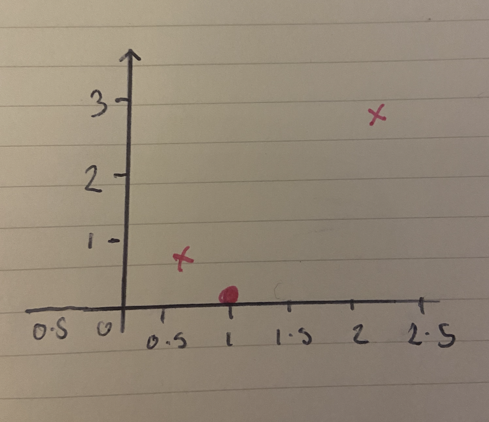

# Linear Regression Single Variable

**Coding examples**

#### [Click here](https://github.com/369geofreeman/machine-learning-algorithms-and-data-structures/blob/main/Machine-Learning-Algorithms/linear-regression-single-variable/lrsv.py) to view a walkthrough of how we implement linear regression  with a single variable

#### [Click here](https://github.com/369geofreeman/machine-learning-algorithms-and-data-structures/blob/main/Machine-Learning-Algorithms/linear-regression-single-variable/predict_multi_values.py) to view the a coding example of linear regression using one variable, which predicts house prices from a csv file and writes them to a new file

#### [Click here](https://github.com/369geofreeman/machine-learning-algorithms-and-data-structures/blob/main/Machine-Learning-Algorithms/linear-regression-single-variable/canada_per_capita_income.py) to view an example of predicting Canada's pre capital income for the year 2020


### Method


**Notation**

* m = Number of traning examples
* x = 'input' variable / features
* y = 'output' variable / target variable


| Size in sq-ft (x) | Price in 1000's (y) |
|-------------------|---------------------|
| 2104              | 460                 | <-
| 1416              | 232                 | <- m = 4 
| 1534              | 315                 | <-
| 852               | 178                 | <-
|		    |			  |
| Input features (x)| rows/ traning ex (y)|

* h𝜣(x) = 𝜣₀ + 𝜣₁ where 𝜣₀ and 𝜣₁ are teh parameters of the model
* (x,y) = One traning example
* (x⁽ⁱ⁾,y⁽ⁱ⁾) = ith traning example where i is the index

for example, from the table above:
```
	x⁽¹⁾ = 2104
	x⁽²⁾ = 1416

	y⁽¹⁾ = 460
	y⁽²⁾ = 232

```


#### How a supervised algorithm works

We start with a traning set, like our traning set of house prices above, and we feed that to our learning algorithm.
It's then the job of the learning algorithm to output a function. Now, the learning algorithm is usually denoted as 'h', which stands for hypothisis.

The job of the hypothesis is to take as input, for instance the size of a house (x⁽ⁱ⁾), and tries to output the estimated value y⁽ⁱ⁾ of the corrisponding house.

So h is a function that maps x's to y's


We represent h as **h𝜣(x) = 𝜣₀ + 𝜣₁**

or **h(x)** for shorthand

what this means is y is a linear function of x


This function is predicting that y is some straight line function of x


This model is called linear regression with one variable, with the one variable being x.
Another name for this is called uni-variable linear regression.


### Cost Function

Remember our hypothesis **h𝜣(x) = 𝜣₀ + 𝜣₁** ?
The 𝜣⁽ⁱ⁾'s we know as the parameters, they control the direction and height of the line in our function. But how do we choose these?

With different 𝜣⁽ⁱ⁾'s we get different hypothesis.

For example, if we have 𝜣₀ = 1.5 & 𝜣₁ = 0, then we get a constant value function which is just a flat line at 1.5


If we have 𝜣₀ = 0 & 𝜣₁ = 0.5, then we get a slope that passes through 2 because it is climbibg at a rate of 0.5 for each 1


And finally, if we have 𝜣₀ = 1 & 𝜣₁ = 0.5, we have a hypothesis that ppasses through the (2,2) point because we start at 1 and climb 0.5 for each 1.


So how do we come up with a good 𝜣₀ & 𝜣₁ to fit our data points in a best fit line?

Well, as an idea we could choose 𝜣₀, 𝜣₁ so that h(x) (x = value we predict) is at least close to the values y for our traning examples (x,y)

We will solve a minimalisation problem to do this.

```
	minimise
	𝜣₀, 𝜣₁
```
And make
```
	(h𝜣(x)-y)² 
```
to be small


Here is the function we will use to do that


To put another way, we are finding the values of 𝜣₀, 𝜣₁ so that the average (1/2m) times the sum of the square errors between our predictions (x⁽ⁱ⁾) minus the actual values of the houses (y⁽ⁱ⁾) on the traning set is minimised.

And this is our overall objective function for linear regression.

By convention we define a cost functionn like this 


And what we want to do is minimise over 𝜣₀ and 𝜣₁ our function J(𝜣₀, 𝜣₁)

This cost function is also called the **Squared error function**

Now lets look at what the cost function is doing and why we want to use it.


**So far we have established**

* Hypopthesis: h𝜣(x) = 𝜣₀ + 𝜣₁, x
The hypothesis gives us a straight line and 𝜣₀, 𝜣₁ define the height and slope of the line
* Parameters: 𝜣₀, 𝜣₁
* Cost function:

* Goal: minimise J(𝜣₀, 𝜣₁)

To better visualise the cost functions, we will work with a simplified hypothesis function
**h𝜣(x) = 𝜣₁x**

* 𝜣₁ is the only parameter
* In this case 𝜣₀ would be 0 which means we will always pass through the origin

The cost function will now look like this:


And the minimise function will be **minimise J(𝜣₁)**


So, the two key functions we want to understand are the **h𝜣(x)** hypothesis function and the **J(𝜣ᵢ)** cost function.


The hypothesis function is h of x. This is a function of x which in our case is, the hypothesis is a function of what the size of a house is (x)

The cost function, J, which is a function of the parameter 𝜣₁, controls the slope of the line

Lets plot these functions


Lets temporary set 𝜣₁ equal to 1 and figure out what is J(cost function) of 𝜣₁ = 1

As usual we define our cost function as follows

 

If we simplify it we get

 


So J(1) = 0 as shown in the example above it is plotted at (0,1)


Now lets look at some more examples.


Suppose 𝜣₁ = 0.5
Then our slope will be 0.5 as shown below

 


Now computing J(0.5), it turns out that the cost function is going to be the sum of the square values of each point defining the line, shown in the img above.
So the difference between (yⁱ) and the predicted value h(xⁱ).
Given that, the first example is going to be
(0.5-1)²
The second will be
(1-2)²
The third:
(1.5-3)²
So the cost function looks like this


So J(0.5) = 0.58, lets plot that on our graph that has the point at 1 already




Another example

What is the value of J(0) when
* m = 3
* h𝜣(x) = 𝜣₁x
And our cost function is as above?

Well, remember the mechanics of this cost function is to square the sum of the distances between the h𝜣(xⁱ) of predicted value and yⁱ of the actual value (which in this case is our house prices)


So we plug in the values 


which gives us a new point on the graph


but what if 𝜣₁ = 0. Then what would J(0) be? Well then it give us a flat line along the x axis which is where our data point is. This is great and exactly what we want.

And if we keep computing these values we will get something like this


So, eventually our computed range of values forms what our function J(𝜣₁) looks like


### To recap


Each value of 𝜣₁ corrisponds to a different straight line fit. We then derive a different value of J(𝜣₁) so each h𝜣(x) will give us another point for J(𝜣₁) towards the data point.

Remember the optimisation objective for our learning algorithm is to choose the value of 𝜣₁ that minimises the values of J(𝜣₁).

So our objective function for linear regression is 
```

	minimise  J(𝜣₁)
	  𝜣₁	 ------

```

And as seen from our example we worked out that 𝜣₁ = 1 which is the perfect line of best fit for our example where the data points were [(1,1), (2,2), (3,3)]


