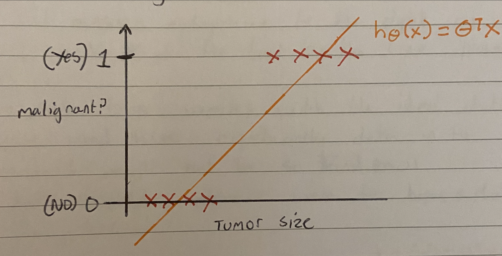
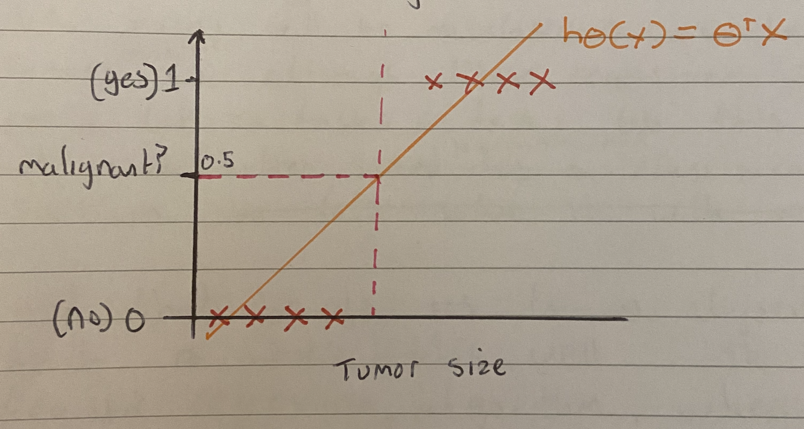
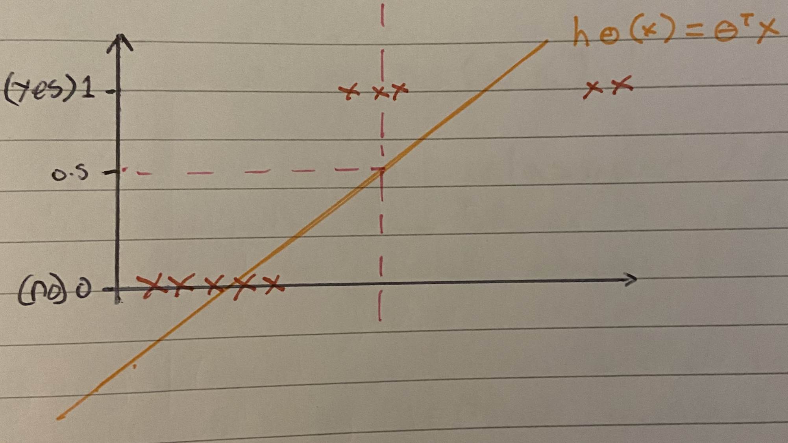
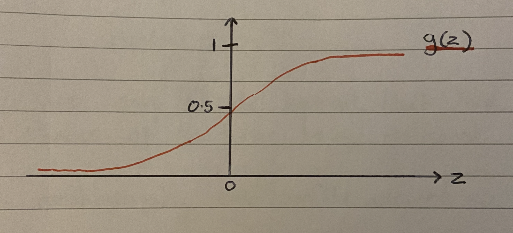
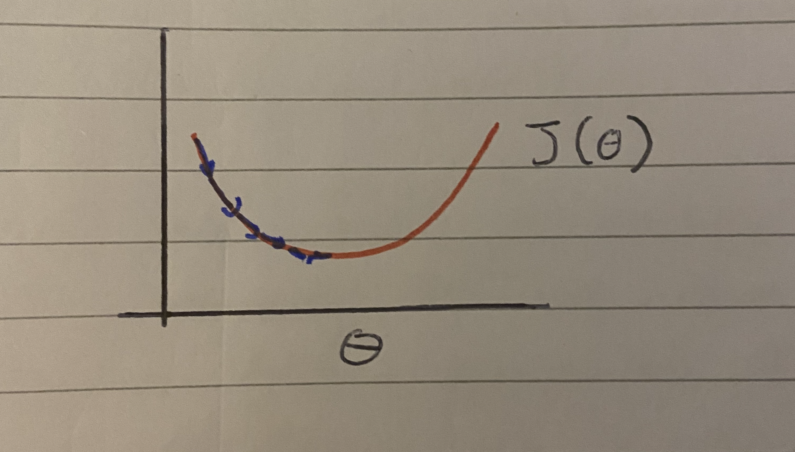
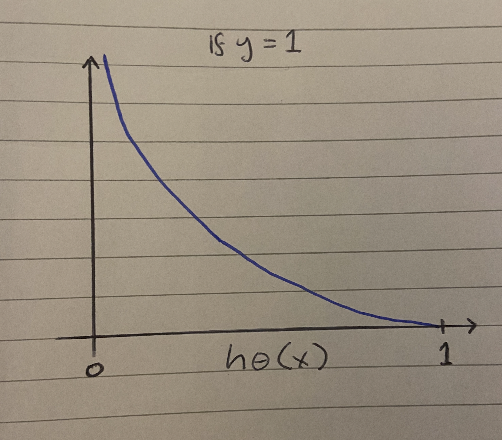
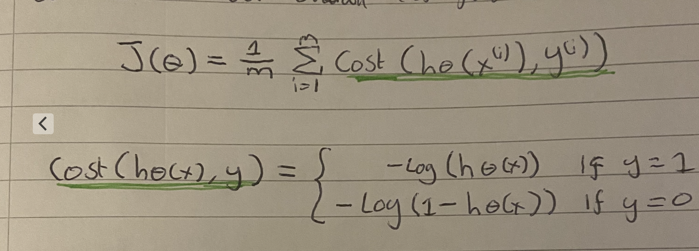
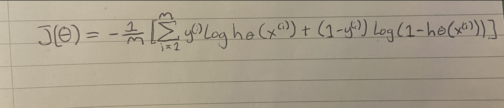
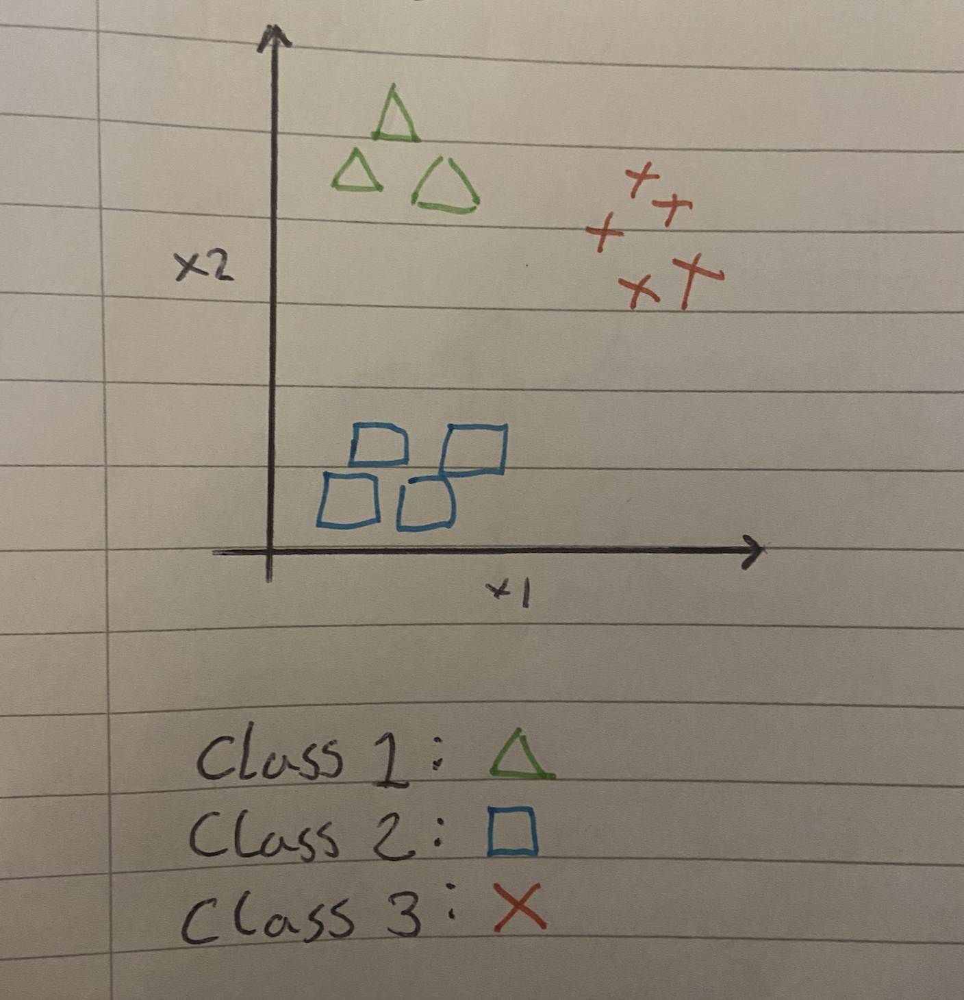
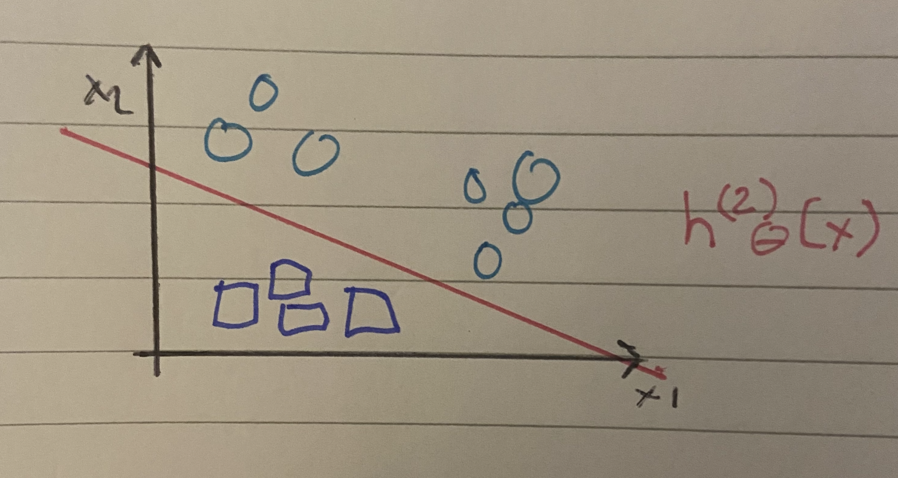

# Logistic Regression


**Code implementations of the functions discussed below**

  * [Code Implementations](#code-implementations)

### Contents

  * [Classification Introduction](#classification-introduction)
  * [How not to solve a classification problem](#how-not-to-solve-a-classification-problem)
  * [Hypostesis Representation](#hypostesis-representation)
  * [Decision Boundry](#decision-boundry)
  * [Non Linear Boundries](#non-linear-boundries)
  * [Logistic Regression Model](#logistic-regression-model)
  * [Simplified Cost Function](#simplified-cost-function)
  * [Advanced Optimisation](#advanced-optimisation)
  * [Multiclass Classification](#multiclass-classification)


## Code implementations

- [Sigmoid Function](https://github.com/369geofreeman/machine-learning-algorithms-and-data-structures/blob/main/Machine-Learning-Algorithms/logistic-regression/code-examples/sigmoid_function.py): An example of the sigmoid function
- [Cost Function](https://github.com/369geofreeman/machine-learning-algorithms-and-data-structures/blob/main/Machine-Learning-Algorithms/logistic-regression/code-examples/cost_function.py): A cost function (and computed gradient) for logistic regression.


## Classification Introduction

A classification problem is where the variable y, that you want to predict, is valued.
Classification is the process where computers group data together based on predetermined characteristics - we know this as supervised learning.
A classic example of this is spam detection in email. We can train a machine learning algorithm with a set of spam-like emails labelled as not-spam. This way our algorithm learns what might be a spam email and dispose of it before it reaches our inbox.

Classification is great with big data and is commonly used to make decissions in governments, economics, medicine and even helps to solve problems with online fraud, classifying stolen credit card information or stolen passwords to name a few. 


All of these problems have one thing in common, they are 'yes' or'no' answers, true or false, 0 or 1. We can view this prediction as y:
```
	y ∈ {0,1}

0 = negative class
1 = possitive class
```

We can also use classification  for multi-class problems too, which we will get to soon. But for now they look something like this
```
	y ∈ {0,1,2,3}
```


**So how do we build a classification algorithm?**

Lets look at a traning set for defining whether a tumor is malignant or benign


Notice the malignancy takes on only two values, zero/no and one/yes


## How not to solve a classification problem


A basic idea to solve this would be to use linear regression and try to figure out how to fit a straight line to the data. Lets try it and see what happens

So we can use our linear regression hypothesis:
```
	h𝜣(x) = 𝜣ᵀx
```

And we get the following result





Then, since we know that the data is either 0 or 1, we could apply a threshold on the classifier outputs at 0.5 that is at the vertical axis at 0.5. 
Then if the hypothesis outputs a value greater than 0.5 we will say y=1. Likewise, if a value is output less than 0.5, we will say y=0

This looks something like this





Now, we can clearly see a seperation from the malignant and benign tumor data points. So now we could just assign everything to the right of the line as 1 and 0 to the left of the line. This would correctly classify all of our points given the data so problem solved right?

Well, while this works with the ideal data used here, unfortuantly data in the real world might not be so kind to us. Which is more often than not the case.

For example, if we were to have a data set like below where the data points are more spread out

 

We can see where we might run into problems. We can clearly see some of the positive data points will be missclassified as benign tumors which is obviously not good.
So although linear regression is great for a lot of tasks, tasks like this one are much better suited to something more advanced like a classification problem.

And that brings us to an algorithm that fits this well... The **Logistic Regression** algorithm, where the predictions are always between zero and one
```
	0 < h𝜣(x) ≦ 1
```


## Hypostesis Representation

Now lets look at the function we will use when working with a classification problem:
```
	Logistic Regression Problem:
	want 0 ≦ h𝜣(x) ≦ 1
```


So, we want our classifier to output values between 0 and 1, and we need a hypothesis that satisfies this property 

Our hypothesis is similar to that of linear regression except that we have a function g()
```
	h𝜣(x) = g(𝜣ᵀx)
```

and g is equal to
```
	g(z) = 1/1+e^-z
z is a real number
```

This is known as the Sigmoid Function or the Logistic Function


An alternative way we can write this sigmoid function is 
```
		    1
	h𝜣(x) =  --------
		 1+e^-𝜣ᵀx
```


Let's take a look at what this looks like plotted on a graph




Notice how z goes to minus infinity as g(z) approaches 0, and as z approaches positive infinity, g(z) approaches 1.

And because g(z) upwards values are between 0 and 1, we also have that h(x) must between 0,1.

Finally, given this hypothesis representation, what we now need to do is fit the parameters 𝜣 to our data, which we will get to later.

But first , let's find out more about how we can interpret the output of our hypothesis h(x)


For example, if we are using the tumor classification example, and
```
	x = |x₀| = |     1    |
	    |x₁|   |tumor size|

h𝜣(x) = 0.7
``` 

Then we can tell the patient that there is a 70% chance of the tumor being malignant.

More mathmatically this can be viewed as
```
	h𝜣(x) = p(y=1|x;𝜣)
```
Which can be read as "Probability that y=1, given x, parameterized by 𝜣"


But since this is a classification task, we know that y can only equal y=0 or y=1

so we use
```
	p(y=0 | x;𝜣) = 1 - p(y=1 | x;𝜣)
```

Which basically says it is a one if we are above half and zero otherwise


## Decision Boundry


One quick thing to note here is, given our hypothesis for linear regression
```
	h𝜣(x) = g(𝜣ᵀx)
	⟶  g(z) = 1/1+e^-z
```

If we where to predict y=1 so h𝜣(x) ≧ 0.5, that would mean 𝜣ᵀx ≧ 0. And if y=0 so h𝜣(x) < 0.5, then 𝜣ᵀx < 0. Because as we remember, 𝜣ᵀx is a range between -1, +1 generally.

Now let's use this to better understand how the hypothesis of logistic regression makes those decissions.

Say we have a traning set like this


And our hypothesis is:
```
	h𝜣(x) = g(𝜣₀+𝜣₁x₁+𝜣₂x₂)
```
And say we choose the following parameters

* 𝜣₀ = -3
* 𝜣₁ = 1
* 𝜣₂ = 1

So our parameter vector will equal
```
	    |-3 |
	𝜣 = | 1 |
	    | 1 |
```

Now let's try and figure out where a hypothesis would end up predicting y=1 and where it would end up predicting y=0

So, we know the probability of y=1 whenever 𝜣ᵀx > 0.

So, from our parameter vector, if we take -3, we can predict y=1 if:
```
y=1 if
	-3+x₁+x₂ ≧ 0
	------------
	    𝜣ᵀx
```

Let's see what this means on our chart. Basically, x₁+x₂ = 3 is the equation for a line, and we can draw that on our graph like so


And so if y=1 (-3 + x₁ + x₂ ≧ 0) then it will be classified to the right of the line, and if y=0 (-3 + x₁ + x₂ < 0) then it will be classified to the left of the line like below


And the line that seperates the data (drawn in green) is known as the **desision boundry**

And our decision boundry (x₁ + xx₂ = 3) corrisponds to 0.5 exactly.


## Non Linear Boundries

Now lets look at some data points that can't be solved linearly, for example


As we can see, no straight line can seperaste this data.

One way we could solve this might be to add higher order polynomeal terms to the features.

Let's say our hypothesis now looks like this, where we added 2 extra features, x₁² and x₂²
```
	h𝜣(x) = g(𝜣₀ + 𝜣₁x₁ + 𝜣₂x₂ + 𝜣₃x₁² + 𝜣₄x₂²)
```

So we now have 5 parameters, 𝜣₀ ⟶  𝜣₄. And for now let's set them like so

* 𝜣₀ = -1
* 𝜣₁ = 0
* 𝜣₂ = 0
* 𝜣₃ = 1
* 𝜣₄ = 1

So our feature vector will be
```
	    |-1 |
	𝜣 = | 0 |
	    | 0 |
	    | 1 |
	    | 1 |
```

And we know our hypothesis is equal to 1 when; predict 1: y=1 if -1 + x₁² + x₂² ≧ 0

Or, in fact if we shift the 1 to the right, we get
```
	predict y: y=1 if x₁² + x₂² ≧ 1
```

And this equation now looks familiar (x₁² + x₂² = 1), most likely because it is the equation for a circle.
Now this will seperate our data very nicely. Everything outside the decision boundry circle is 1 and everything inside it is 0


So basically, with more complicated data we can use more complicated boundries in the form of polynomials to seperate our data


## Logistic Regression Model


**Cost function**


Now we need to find a way to fit the parameters of 𝜣 for the logistic compression.

We'll use a cost function to fit the parameters

What we are looking for is a cost function that is convex. So a nice smooth curve that has one local minima like below




Now, because of our sigmoid function being non-linear, we can't use a square error cost function otherwise we will end up with it being non-convex

So what will our cost function look like?

```
			{ -log(h𝜣))     if y = 1
	cost(h𝜣(x),y) = {
			{ -log(1-h𝜣(x)) if y = 0
```

This basically means the penalty that the algorithm pays, say if h(x) = 0.7 for instance, and that would be y=1, then -log(h𝜣(x)). 
The penalty it pays is higher the further away from 1 it is, in this case 0.3

To better visualise this, let's look at it plotted below





So above is our cost function for y=1 (-log(h𝜣(x)))


Notice how as h(x) approaches 0, it goes on for ∞. Equally if we were to plot for y=0, as h𝜣(x) approaches 1, it would go on for ∞ too.

If we were to, for instance predict h𝜣(x) = 0 (for the graph above where y=1), we would end up paying a very large cost. The further  from 0 it is, the higher the cost, as seen in the graph.

Inversly, if y=0, then the further to 1 we approach with our prediction h𝜣(x), the more we will penalise the result.

Some examples are:

```
	- if h𝜣(x) = y, then cost(h𝜣(x),y = 0 (for y=0 and y=1)
	- if y = 0, then cost (h𝜣(x), y ⟶  ∞ as h𝜣 ⟶  0
	- Regardless of whether y=0, if h𝜣(x) = 0.5, then cost(h𝜣(x),y) > 0
``` 


## Simplified Cost Function

So here is our overall cost function



Now, because y is always equal to 0 or 1, we can simplify this equation

For instance, the cost function will look like this
```
	cost(h𝜣(x) = - y log(log(x)) - (1-y)log(1-h𝜣(x))
```

now we need to minimise the cost function, we can do this with gradient decent.

Here is the cost function




And here is our template for gradient decent where we repeatedly update each parameter by updating it as itself minus the learning rate, alpha (𝞪) times the derrivative term

```
want min𝜣 J(𝜣):

	repeat {
		𝜣ᵢ := 𝜣ᵢ - 𝞪 ∂/∂𝜣ᵢ J(𝜣)
	}

Simultaneously update all 𝜣's
```

Something to note here is, this equation is almost identical to that of linear regresion

So are they the same algorithm? For linear regression we had h(x) = 𝜣ᵀx, for gradient decent this had changed to h(x) = 1/1+e^-𝜣ᵀx


## Advanced Optimisation

To get gradient decent to run as fast as possible and scale much better to larger machine learning problems, we will look at some optimisations we can do.


Here is an alternative view of what gradient decent is doing.

We have some cost function J(𝜣) and we want to minimise it. Taking the input parameters 𝜣 we will compute two things; J(𝜣) and the partial derivative terms for J=0,...,J=n,

Seen here
  * J(𝜣)
  * ∂/∂𝜣ᵢ J(𝜣)


So given these two things, gradient decent repeatedly applies the following update
```
	repeat {
		𝜣ᵢ := 𝜣ᵢ - 𝞪 ∂/∂𝜣ᵢ J(𝜣)
```

Another way to think about it is we need to supply code to compute J(𝜣) and ∂/∂𝜣ᵢ J(𝜣), and then get them plugged into gradient decent which will minimise the function for us.

Some other optimisation algorithms that are useful to know due to not having to pick an 𝞪 or because tey are simply much faster than gradient decent are:
  * Conjugate Gradient
  * BFGS
  * L-BFGS

They compute the derivative and cost function in a clever way using an inner loop that automatically picks a good learning rate (𝞪), and can even pick a different learning rate for every iteration if needed.


## Multiclass Classification


**Now lets see how we can get linear regression to work with multiclass classification problems**

So, an example of a multiclass classification problem could be to optimise or tag your email into different folders based off of the content like so
  * y1 = work
  * y2 = friends
  * y3 = family
  * y4 = hobby

or another example, if we were building an algorithm to predict the weather, we might pick
  * y1 = sunny
  * y2 = rainy
  * y3 = cloudy
  * y4 = stormy

etc


Multiclass classification looks like this, where we can see the multiple classes


But how do we get a learning algorithm to work with these multiple classes?

Obviously with a binary classification we can seperate the data with a line but in this case we have more than 2 classes.

So to linearly seperate more than 2 classes we will use a classification method called **One vs All** classification

Lets say we have a training set like so:




The idea is to turn this into 3 seperate binary classification problems.

To start lets begin with class 1, where we say classes 2 and 3 are negative and class 1 is possitive, illustrated below


Now we will fit a classifier h𝜣(x) that seperates the triangles as 1/possitive, and the circles as 0/negative as shown with the pink line

Next we can do the same for class 2




And lastly we would do the same for the last class, class 3 with h𝜣⁽³⁾(X), which will seperate all the classes in our case.

To summerise, we have 3 classifiers, we'll fit a classifier h𝜣⁽ⁱ⁾(x), thus trying to estimate what the probability that y is equal to class i, given x;𝜣
```
	h𝜣⁽ⁱ⁾(x) = P(y=i | x;𝜣) (i = 1,2,3)
```

So in the first example, it was trying to predict where the triangles are and then labled them as 1 and the rest as 0. 
What is the probability that i=1 given P(y=1 | x;𝜣). Then the same with the squares and x's.


So we want to train a logistic regression classifier h𝜣⁽ⁱ⁾(x) for each class i, to predict the probability that y = i.

On a new input x, to make a prediction, pick the class i that maximises
```
	max h𝜣⁽ⁱ⁾(x)
	 i
```
