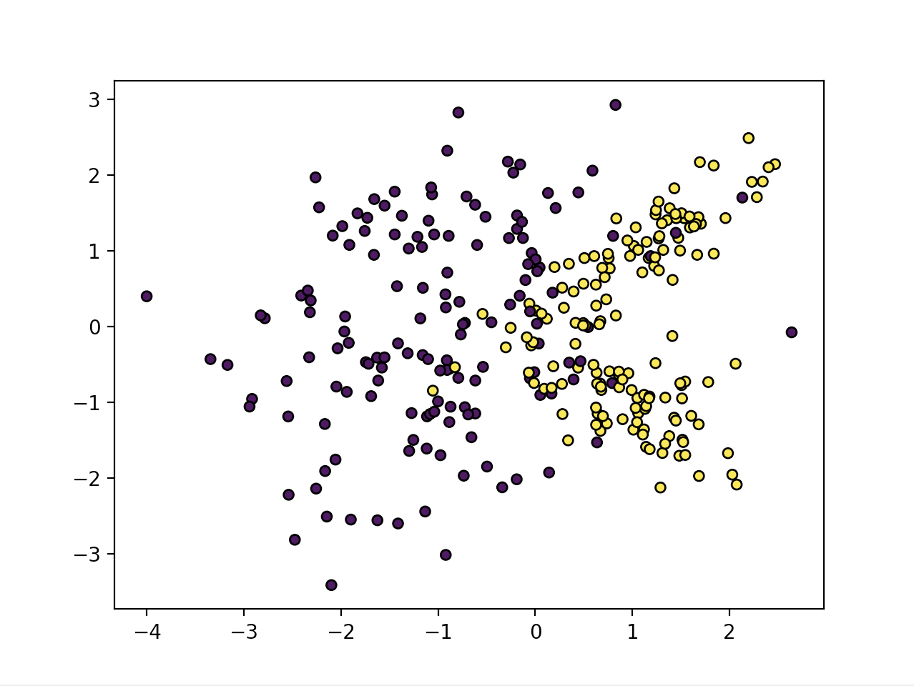

#  Naive Bayes


### Code

**Implementation from scratch**
  * [Naive Bayes class](https://github.com/369geofreeman/machine-learning-algorithms-and-data-structures/blob/main/Machine-Learning-Algorithms/naive-bayes/Naive_Bayes.py)
  * [Testing script](https://github.com/369geofreeman/machine-learning-algorithms-and-data-structures/blob/main/Machine-Learning-Algorithms/naive-bayes/Naive_Bayes_Tests.py)

### Contents
  * [Overview](#overview)
  * [Bayes Theorem](#bayes-theorem)
  * [Use Cases](#use-cases)
  * [Naive Bayes from scratch](#naive-bayes-from-scratch)


## Overview

Naive Bayes is a classificattion algorithm that's known for it's speed and reliability, especially when used on small data sets, it can be quite elegant.
It's a probabilist machine learning model that's based on bayes theorem.

The general idea is that using Naive bayes we find find the probability of 'A' happening given that 'B' has occured where:
  * A: Hypothesis
  * B: Evidence

The "native" part of the name comes from the fact one feature does not affect the others, hence they are naive of each other, the features are independent.
It's use cases are particually good where the posbability of a class is determined by the probabilites of some casual factors.
Natural lanuage processing (**NLP**) holds a number of ideal examples, a piece of text can be considered as a particular instance of a dictonary, or using an arbitrary phrase like _'One does not simply walk into mordor'_ as a google search will yield the results of the Lord of the Rings movie franchise. Basically in the case of **NLP** it understands that the user is refering to that movie despite not explicitly mentioning it. 


Before we step into the guts of using Naive Bayes, forst lets take a closer look at the Bayes theorem itself.


## Bayes Theorem

Bayes Theorem is widley regarded as one of the most important formulas in probability.
Simply put, it's a way of finding a probability when we know certain other probabilities

Which looks like this
```
		 P(A) P(B|A)
	P(A|B) = ------------
		    P(B)
```

Which tells us:
  * How often A happens given that B happens. Written P(A|B)
When we know:
  * How often B happens given A happens. Written P(B|A)
  * How likely A is on it's own. Written P(A)
  * How likely B is on it's own. Written P(B)


For example, when we use a search engine and input something abstract like song lyrics or "Movie automatic shoe laces", it knows from lot's of other searches that most likely, people are probably looking for information about that song or movie _"Back to the future"_ in the second case. This is done using bayes theorem.


This is how the theory looks in a more Machine Learning notation example
```

		 P(y|X).P(y)
	P(y|X) = ------------
		    P(X)

With feature X:
	X = (x1,x2,x3,...,xn)


```

An example from a study conducted by Daniel Kahneman and Amos Tversky illustrates this well, although later criticised, it is still a great general example.

Given the phrase:
```
"Steve is very shy and withdrawn, invariably helpful but with very little interest in people or in the world of reality. A meek and tidy soul, he has a need for order and structure, and a passion for detail"
```
Now, what is the liklyhood that steve is a librarian compared to the likelyhood that he is a farmer?

Because of the phrases _"Shy and withdrawn"_ and _"Meek and tidy"_, the overwhelming response is that he is most likely a librarian.
But, maybe we overlooked something? Something that makes this irrational!
The ratio of farmers to librarians is close to 60-1 in the US (Twersky and Kahneman published it as 20-1 but this difference doesn't change much)

So with this new evidence we could say, given 200 farmers and 10 librarians, if upon first hearing about Steve, we was to make the assumption of say, there is about 40% of librarians that fit that description, and only about 10% of farmers that fit that same description.
So from our inital data sample of 10 librarians and 200 farmers there would be 4 librarians and 20 farmers that fit this description.

So even though we thought there was a much more likely chnace of Steve being a librarian, with this new data the probabiity of Steve being a farmer greatly outweighs our inital prediction of him being a librarian. 
We can write this as the probability of steve being a librarian is 4 over 24 or:
```
					    4
	P(probability given description) ------ = 16.2%
					 4 + 20
```

Using this we have fit the numbers together to update our inital beliefs based on new evidence.


Let's try this with a different example

Let's say:
  * Dangerous fores are rare (1%)
  * Smoke is fairly common (10%) due to barbecues
  * 90% of fires make smoke


We can then use this information to discover the probability of a dangerous fire when there is smoke.
```
			P(Fire) P(Smoke|Fire)
	P(Fire|Smoke) = ---------------------
			      P(Smoke)


   	   1% * 90%
 	=  --------   = 9%
 	     10%
```


So there is a 9% chance of a dangerous fire given these statistics.


## Use Cases


Naive Bayes works particually well with small data sets.

It's used:
  * To mark emails as spam, or not spam
  * To correctly classify articles into their categories
  * To check a piece of text expressing possitive emotions or negative emotions
  * Credit card fraud prediction
  * Health risk prediction

Due to its simplicity, Naive Bayes might outperform more complex models when the data set isn't large enough for them

There are 3 variants of Naive Bayes that are most common and we'll go though each of them. But first lets implement our own modest version from scratch.


##  Naive Bayes from scratch


  * To see the full code, you can view it [here]((https://github.com/369geofreeman/machine-learning-algorithms-and-data-structures/blob/main/Machine-Learning-Algorithms/naive-bayes/Naive_Bayes.py)
  * To test the code, you can [here]((https://github.com/369geofreeman/machine-learning-algorithms-and-data-structures/blob/main/Machine-Learning-Algorithms/naive-bayes/Naive_Bayes_Tests.py)


**Below is a basic version of the Naive Bayes class**

```
class NaiveBayes:

    def fit(self, X, y):
        """
        X: Traning data. Numpy ndarray, where the first
           dimension is the num samples, second dimension
           is num of rows
        y: Traning labels. 1d row vector of size num of samples
        """
        n_samples, n_features = X.shape
        self._classes = np.unique(y)
        n_classes = len(self._classes)

        # init mean, variance and priors
        self._mean = np.zeros((n_classes, n_features), dtype=np.float64)
        self._var = np.zeros((n_classes, n_features), dtype=np.float64)
        self._priors = np.zeros(n_classes, dtype=np.float64)

        for c in self._classes:
            X_c = X[c == y]
            self._mean[c, :] = X_c.mean(axis=0)
            self._var[c, :] = X_c.var(axis=0)
            self._priors[c] = X_c.shape[0] / float(n_samples)


    def predict(self, X):
        """
        Takes multiple samples
        X: Test samples
        """
        y_pred = [self._predict(x) for x in X]
        return y_pred


    def _predict(self, x):
        """
        Takes one sample
        X: test samples
        """
        posteriors = []

        for idx, c in enumerate(self._classes):
            prior = np.log(self._priors[idx])
            class_conditional = np.sum(np.log(self._pdf(idx, x)))
            posteriour = prior + class_conditional
            posteriors.append(posteriour)

        return self._classes[np.argmax(posteriors)]


    def _pdf(self, class_idx, x):
        """
        Probability density function
        """
        mean = self._mean[class_idx]
        var = self._var[class_idx]
        numerator = np.exp(-(x-mean) ** 2 / (2 * var))
        denominator = np.sqrt(2*np.pi * var)

        return numerator / denominator
```


Now that we have a basic understanding of how it works, lets take a look at the 3 main versions of naive bayes using the sklearn library


## Bernoulli Naive Bayes

Bernoulli naive bayes is binary distribution and it's useful when a feature can be present or absent. Ie, it can have only two possible outcomes (0,1)/(True/False) etc.

The probabability looks like this:
```
	     p if X=1
	P(X) 		where q=1 - p and 0<p<1
	     q if X=0
```

the input vectors X, are assumed to be multivariate, benoulli distributed and each feature is binary and independent.
The parameteres of the model are learned according to a frequency count. For instance, if there are n samples with m features, the probability for the iᵗʰ feature is:
	 N𝐱⁽ⁱ⁾ counts the number of times the iᵗʰ value = 1.

So:
```
	      N𝐱⁽ⁱ⁾ = 1
	pⁱ =  ---------
	          n
```


Lets test this with scikit-learn, first we are going to need a dummy dataset.

let's generate a random n-class classification problem.

Bernoulli Naive Bayes expects binary feature vectors however, the BernoulliNB class has a binarize parameter which allows us to specify a threshold that will be used internally to transform the features

```
From sklearn.datasets import make_classification

nb_samples = 300

X,y = make_classification(n_samples=nb_samples, n_features=2, n_informative=2, n_redundant=0)
```

Make_classification is a function that generates a random n-class classification problem. We pass it 300 for the number of samples we want to test, set it to have 2 features, both informative where none are redundent.

Here is the bidimansional data set plotted to a graph




For the binary threshold we can use 0.0 so each point can be characterised by the quadrant where it is located

```
from sklearn.naive_bayes import bernoullinb
from sklearn.model_selection import train_test_split

x_train, x_test, y_train, y_test = train_test_split(x,y, test_size=0.25)

bnb = bernoullinb(binarize=0.0)
bnb.fit(x_train, y_train)

bnb.score(x_test, y_test)

```

The score for this particular case was 
```
	The score for Bernoulli Naive Bayes is: 0.92
```

which is really good. Now lets see how it binarized/seperated the data

If we pass the data set as [[0,0],[0,1],[1,0],[1,1]] we should get the results in an array of [0,0,1,1]

Which is exactly what we predicted.

**The full code for Bernoulli Naive Bayes can be found [here](https://github.com/369geofreeman/machine-learning-algorithms-and-data-structures/blob/main/Machine-Learning-Algorithms/naive-bayes/bernoulli_nb.py)**


