# Activation Functions

Below is a collection of activation functions with a brief description of their use case and how they fit well for the required problem.


## Contents

* [Quick Reference Table](#quick-referance-table)
* [Hard Limit / Binary Step](#hard-limit-binary-step)
* [Linear Function](#linear-function)
* [Sigmoid Function](#sigmoid-function)
* [Tanh Function](#tanh-function)
* [ArcTan Function](#arctan-function)
* [ReLU Function](#relu-function)
* [Leaky ReLU](#leaky-relu)
* [Exponential Linear Units, ELU](exponential-linear-units-elu)
* [Swish Function](#swish-function)
* [Softmax Function](#softmax-function)


## Quick Reference Table


| Function                      | Plot                                                      | Formula                                         |
|-------------------------------|-----------------------------------------------------------|-------------------------------------------------|
| Hard Limit / Binary Step      | 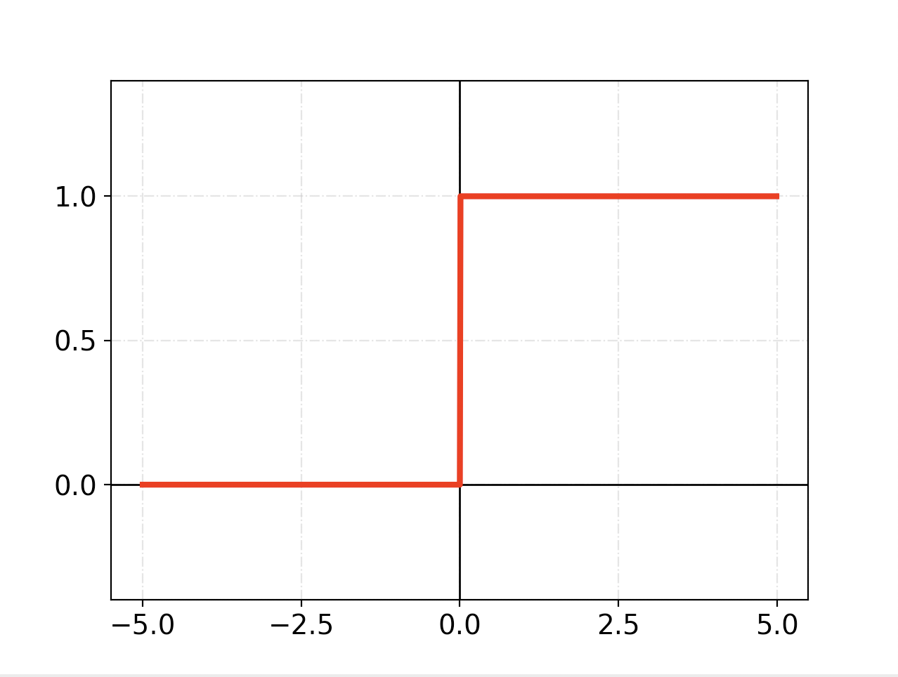      | 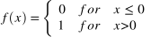   |
| Linear                        | 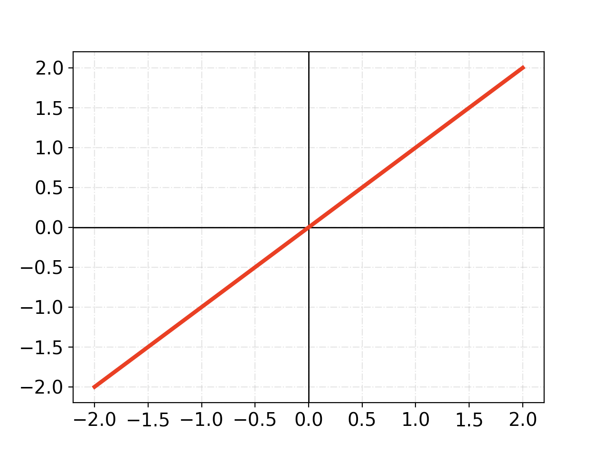  | A = cx                                          |
| Sigmoid                       | 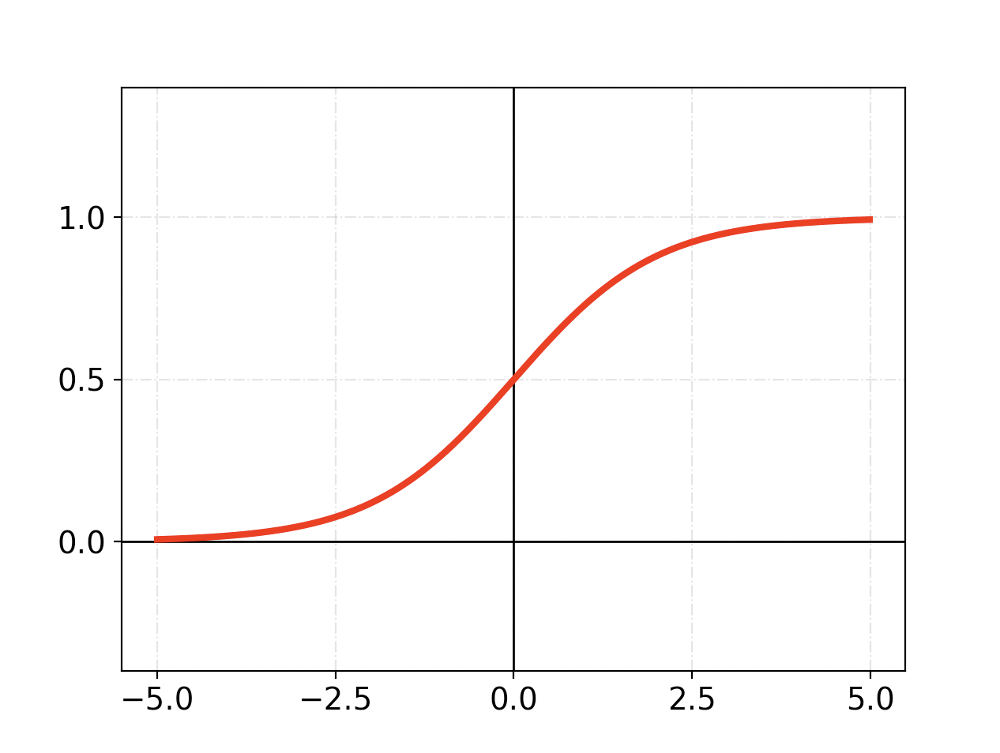 | 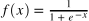    |
| Tanh                          | 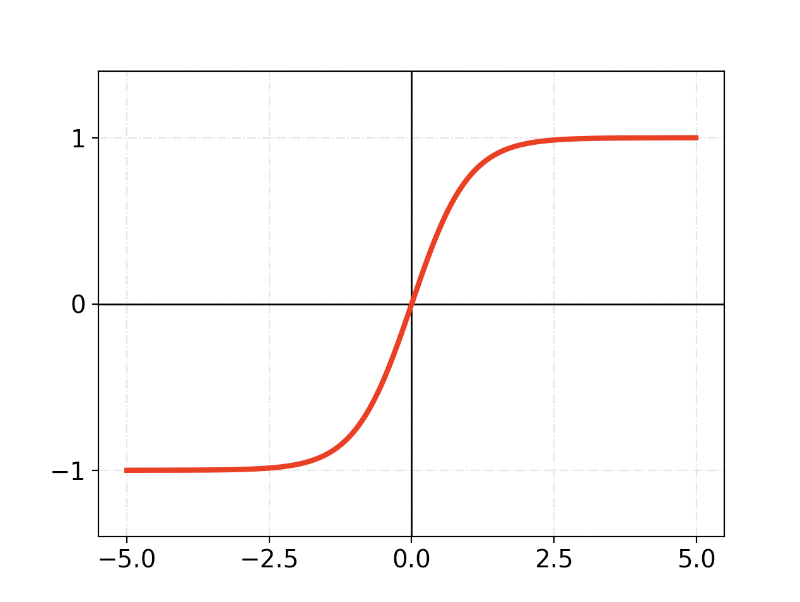    | 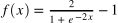    |
| ArcTan                        | 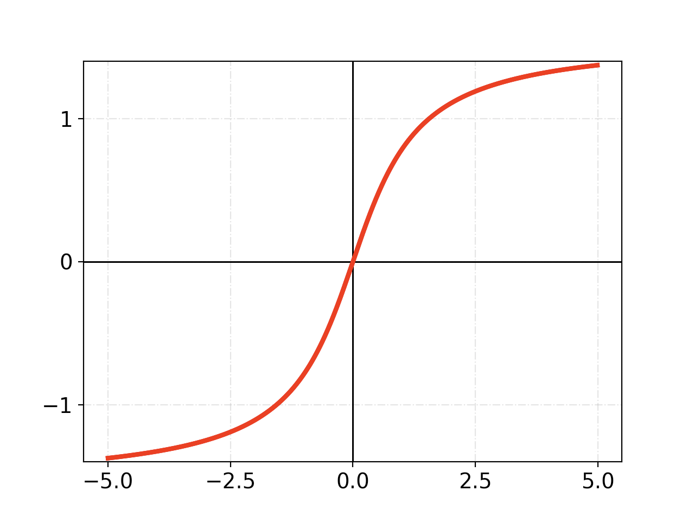           | 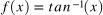   |
| ReLU                          | 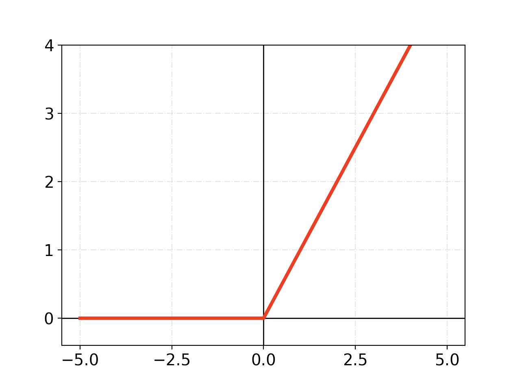             |  |
| Leaky ReLU                    | 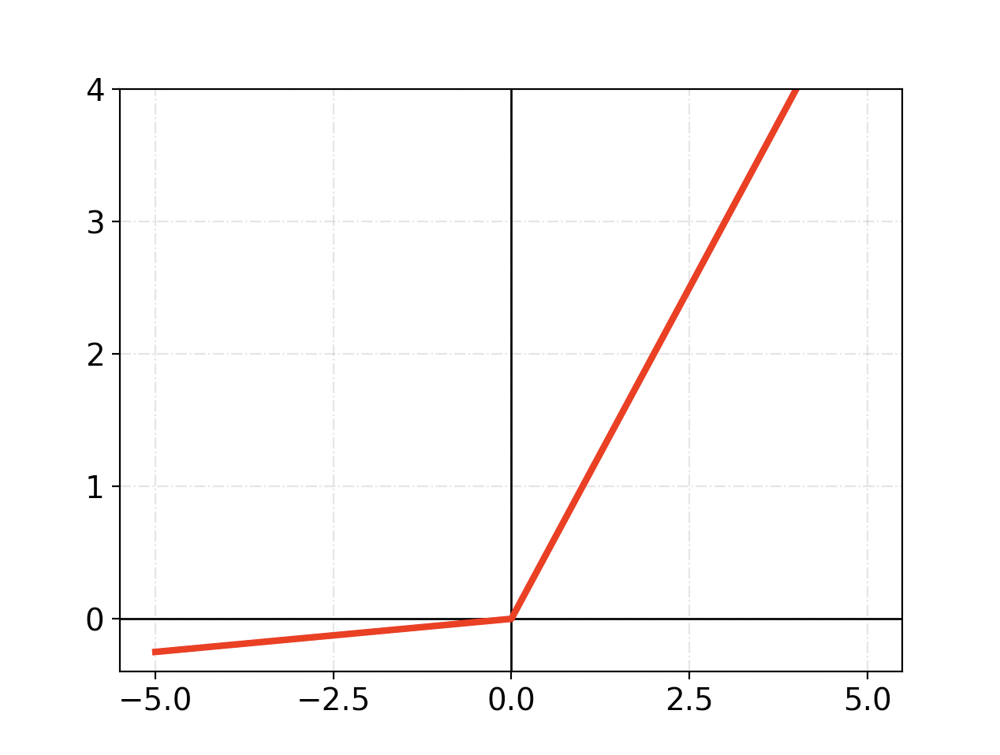       | 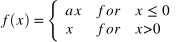  |
| Exponential Linear Units, ELU | 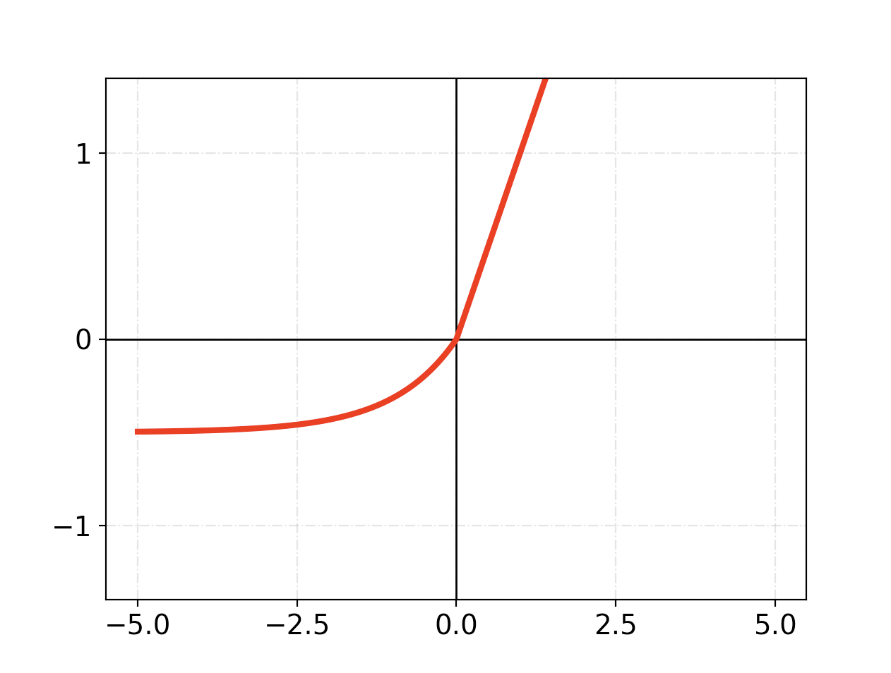              | 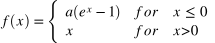  |
| Swish                         | 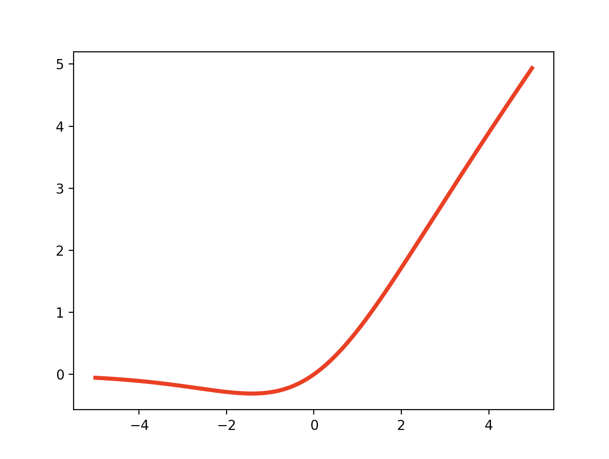            | 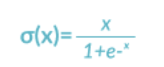   |


## Hard Limit / Binary Step


The hard limit or binary step activation function sets the output of the neuron to 0 if the function argument is less than 0, or 1 if the argument is greater than or equal to 0.

**Best used for** When we are trying to create a binary classifier due to the binary output. Ie, Although it should be noted that this can be problematic with backpropagation due to the zero output, calculating the derivative of f(x) with respect to x will be equal 0


**Formula:**
```
	       { 1 if x ≧ 0
	f(x) = |
     	       { 0 if x < 0
```

This can be coded as a simple if else statement in python

**Python implementation**
```
	def binary_step(x):
    	    return 0 if x < 0 else 1
```

**A visulisation of the Hard Limit / Binary Step activation function**


## Linear Function


The Linear function gives an output based on the input. That is it takes the inputs, multiplied by the weights for each neuron, and creates an output signal proportional to the input.

It should be noted we can not use backpropagation with this activation function.
Also, no matter how many layers in the neural network, the last layer will be a linear function of the first layer. Basically it turns the neural network into just one layer.

**Formula**
```
	f(x)=ax
```

**Python implementation**
```
	def linear_function(x):
    	    return 4*x
```


**A visulisation of the Linear activation function**


## Sigmoid Function


The popular sigmoid takes in any input and squashes the output into the range 0 to 1. It's commonly use in multilayer networks that are trained using backpropergation.


**Formula**
```
	       1
	a =  ------
	      1+e⁻ⁿ
```

**Python Implementation**
```
	def sigmoid_function(x):
             return (1/(1 + np.exp(-x)))
```

**A visulisation of the Sigmoid activation function**


## Tanh Function


Similar to the Sigmoid function, Tanh differs by being symetrical around the origin and the results range from -1 to 1.

As Tanh is zero centered, the gradients are not restricted to movce in a certain direction. This can make it more desiarable over the Sigmoid function and makes it easier to model inputs that have strongly negative, neutral, and strongly positive values. 


**Formula**
```
	tanh(x)=2sigmoid(2x)-1
```


**Python Implementation**
```
	def tanh_function(x):
    	    z = (2/(1 + np.exp(-2*x))) -1
    	    return z
```


## ArcTan Function


The Arctangent, Arctan function is the inverse of hyperbolic Tangent, Tanh. Monotonicity, it provides a convex error surface so optimisation can be achieved faster


**Formula**
```
	f(x)=tan−1(x)
```

We can use numpy to easily generate the arctan

**Python Implementation**
```
	def arctan(x):
            return np.arctan(x)
```


## ReLU Function


The Rectified Linear Unit, or ReLU function is a popular **non-linear** activation function, especially in deep learning.

The ReLU function does not activate all the naurons at the same time. This means that the neurons will only be deactivated if the output of the linear transformation is less than 0. 

**It's important to note** that this can cause unused, or 'dead' neurons. The Leaky ReLU function is a solution to this


**Formula**
```
	     { 0 for x ≦ 0 
	f(x)=|
	     { 1 for x > 0
```


**Python Implementation**
```
	def relu_function(x):
            return np.vectorize(lambda x: 0 if x < 0 else x, otypes=[np.float])

```


## Leaky ReLU


The Leaky ReLU function is very similar to the ReLU function. In fact it is just an improved version. Where as teh ReLU function can  leave unused, or 'dead' neurons, the Leaky ReLU allow a small, positive gradient when the unit is not active. this causes the gradient of the left side of the graph to come out as a non zero value. Therefour we would no longer encounter dead neurons in that region.


**Formula**
```	       
	       { 1 for  x ≧ 0
	f'(x) =|
               { 0.01 for x < 0
```


**Python Implementation**
```
	def leaky_relu_function(x):
		return np.vectorize(lambda x: 0.01 if x < 0 else x, otypes=[np.float])
```


## Exponential Linear Units, ELU


The Exponential Linear Units, ELU, is another variation of the popular ReLU function. It also tackles the problem of unused or 'dead' neurons, but does so with a log curve for defning the negative values rather than a straight line. ELU becomes smooth slowly until its output equal to -α whereas RELU sharply smoothes.


**Formula**
```
	       { z        if z > 0
	f(x) = |
	       { α.(𝑒𝑧–1) if 𝑧 <= 0
```


**Python Implementation**
```
	def elu_function(x):
	    return np.vectorize(lambda x: x if x > 0 else 0.5 * (np.exp(x) - 1), otypes=[np.float])
``` 

## Swish Functtion


The Swish activation function was recently developed by Google and has outperformed the ReLU function in deep models with a similar level of computational efficiency. Notice that it is not monotonically increasing.

**Formula**
```
	f(x) = x*sigmoid(βx)

β is an adjustable parameter
```

**Python Impementation**
```
y = []
beta = 0.9
for i in x:
    y.append(i*sigmoid_function(beta*i))

```

## Softmax Function

The Softmax function is usually used as the last activation function in a neural network as it normalises the results to a probability distribution over predicted output classes. Basically it puts the results in the range of 0 to 1 where each component added together adds up to 1 so they can be interpreted as probabilities. The larger the input the larger the probability it will hold.

For this example we will use a python implementation to show the results
```
# example of a function for calculating softmax for a list of numbers
from numpy import exp
 
# calculate the softmax of a vector
def softmax(vector):
	e = exp(vector)
	return e / e.sum()
 
# define data
data = [1, 3, 2]
# convert list of numbers to a list of probabilities
result = softmax(data)
# report the probabilities
print(result)
# report the sum of the probabilities
print(sum(result))
```

The code abov outputs the results 
* [0.09003057 0.66524096 0.24472847]

And summed together:
1.0


## Source

* [MachinelearningMastery](https://machinelearningmastery.com/softmax-activation-function-with-python/)
* [Kai Siebenrock](https://github.com/siebenrock)
* [Dishashree Gupta](https://www.analyticsvidhya.com/blog/2020/01/fundamentals-deep-learning-activation-functions-when-to-use-them/)

