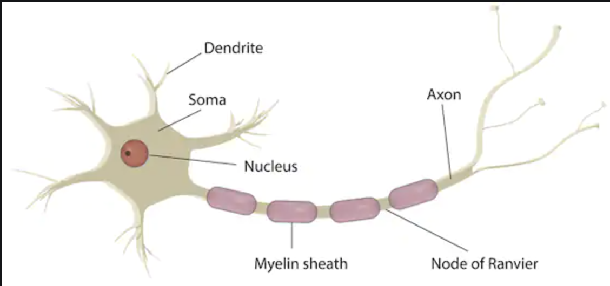
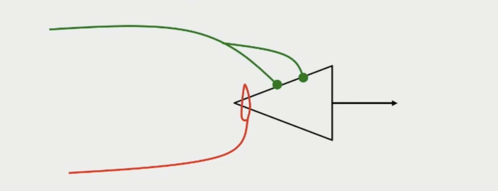
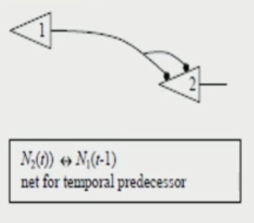
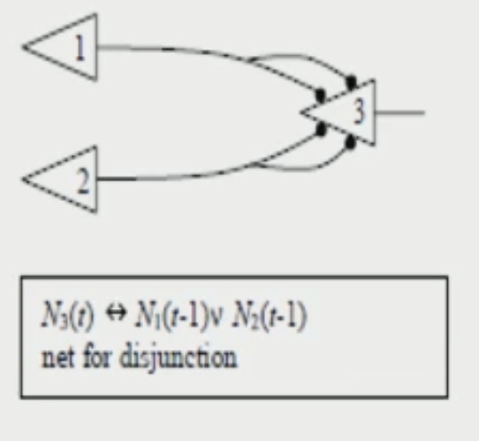
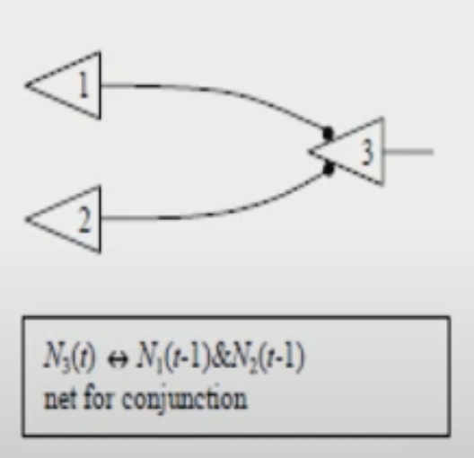
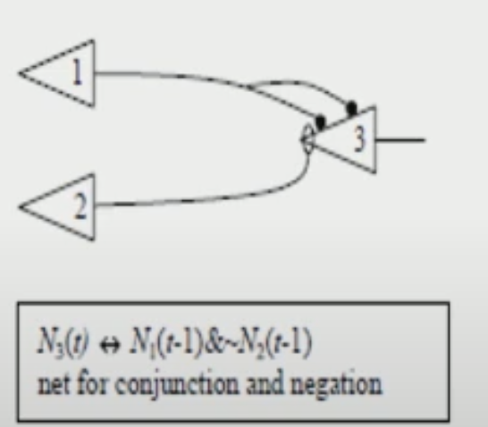
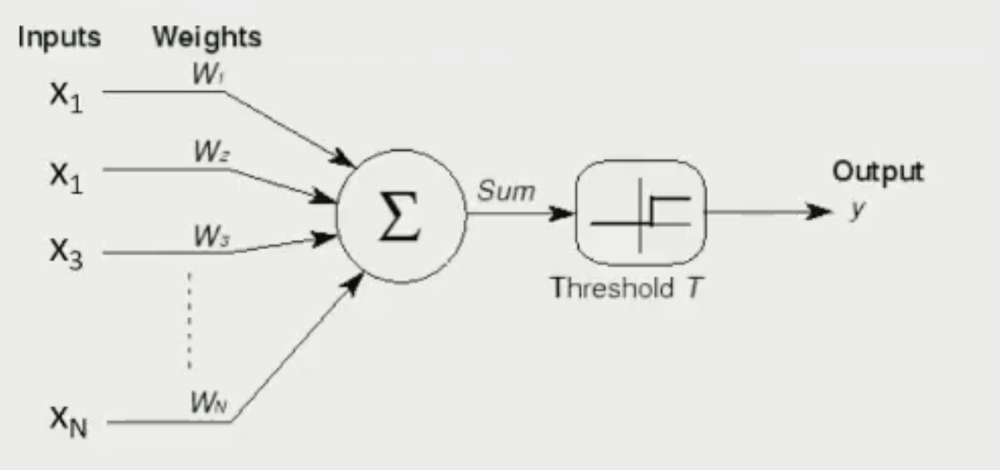
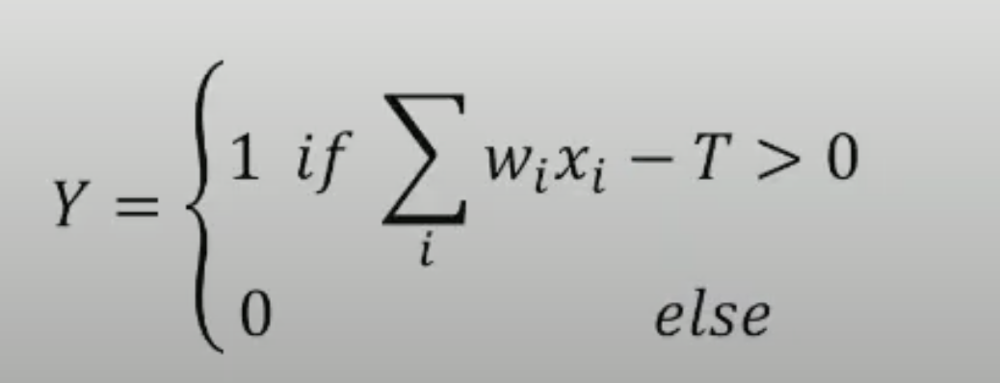

# Perceptron


### Code

pass

### Contents

  * [A Brief History](#a-brief-history)
  * [Overview](#overview)
  * [Simple Pattern Recognition](#simple-pattern-recognition)


## A Brief History

_**"If the brain was simple enough to be understood - we would be too simple to understand it!"**_ - Marvin Minsky

Developed in 1958 at the  Cornell Aeronautical Laboratory by Frank Rosenblatt, the Perceptron algorithm is based on a simplified model of a biological neuron and is considered to be the first working example of a thinking machine.

To understand how this concept came to be, we can look at the background leading up to the creation of the Perceptron starting with the neuron.

A neuron is an electrically excitable cell that communicates with other cells via specialized connections called synapses



Here we can see a neuron is made up of Dendrite, soma and axon. Signals come through the dendrites into the soma and then goes out via the axon to other neurons

Mathematically we can view a neuron like this



The above image is from the 1943 paper _"A logical calculus of the ideas immanent in nervous activity"_ [found here](https://www.cs.cmu.edu/~./epxing/Class/10715/reading/McCulloch.and.Pitts.pdf) written by WARREN S. MCCULLOCH AND WALTER PITTS

This could easily be viwed as the first real origin in the development of _thinking machines_ by modern standards. it shows us that a neuron has two incoming synaptic connections. The first, called the excitatory synapse (shown in green), transmits weighted input to the neuron. If the total number of of synaptic connections (input) exceeds the threshold, the neuron will fire.
That is unless the second connection sends a signal. If the inhibitory synapse (second signal) does send any signal it will prevent the neuron from firing.

This is a very powerful  idea and it means that using this model we can produce lots of boolean functions.
For instance, we can show this with boolean gates.

For the following examples we will set the threshold to 2. Ie, in order to send an output pulse, each neuron must receive two excitory inputs and no inhibitory inputs.

_Lines ending in a dot represent exatory connections, lines ending in a hoop represent inhibitory connections._




Here we have a signal coming in from 1 (the first neuron) that connects to the second neuron (2) with two synapses. The incoming signal is 2 which meets our threshold requirements so the second neuron is fired afterwards. This is a **delay**





Now in this example we have 2 neurons (1 and 2) each connecting to neuron 3 with two synapses, if either of the two signals fire it will cause nauron 3 to fire because we again meet the threshold. This is an **OR boolean gate.**

Now following the same logic, we can recognise the following two boolean gates as:



**AND logic gate**



**1 and NOT 2 logic gate (2 cannot fire but 1 must fire)**


So using these basic units, we can construct fairly complecated boolean circuits but can this machine think or learn?
Well no. Despite this and  proposed theories, no learning mechanism was ever produced by McCulloch and Pitts, but it was a good starting point.


A few years later in 1958,  Frank Rosenblatt came up with the algorithm for the Perceptron that was a step further than what had been created before. 

here we can see a simplified mathmatical model of it





As we can see, it more closely relates to that of a neuron cell. What makes the pecptron superiour to MacCulloch and Pitts model is the use of weights associated with the inputs.
Basically, this means that the total input that the neuron gets is that of the weighted sum of all of the the inputs. Each input is multiplied by it's weight and all of them combined will equal the weighted sum that the neuron recieves. 

if this weighted sum exceeds a predetermined threshold, then the neuron will fire.

Mathmatically we can write this as:



Upon the conception of the Perceptron, Roosenblatt assumed it could represent any boolean circuit and perform any computation. This led to extremely large funding from the US Navy and once the media got wind of it, extreme exageration:

**_"The embryo of an electronic computer that [the Navy] expects will be able to walk, talk, see, write, reproduce itself and be conscious of its existence."_** - The New York Times - 1958


**_"Frankenstien monsterdesigned by Navy that thinks"_** - Tulsa, Oklahoma Times - 1958

As well as coming up with the model, Roosenblatt also provided a learning mechanism.
He realised that if he wanted this unit to learn a specific function he could keep providing it examples of input/output pairs. If he recieved a wrong (boolean) output, he could simply adjust the weights by the difference of what the output must be and what the output really is. (We will dive further into this later). This is known as the **Perceptron learnig rule**

The proved mathmatically that this converged and if the result could be represented as a boolean, it would converge to the correct solution.

[This video](https://www.youtube.com/watch?v=7BtLqqJVP9w&ab_channel=ComputerweltPodcast) shows him using it to predict the gender of a person by looking at a photograph.

The Perceptron could also solve the same logic gates as McCulloch & Pitts model but this hype wasnt to last long.
There was one logic gate that it couldn't solve, the XOR gate. A book published by Marvin Minsky and Seymour Papert in 1969 called _"perceptrons"_ showed solving an XOR gate with a single layer Perceptron to be impossible.

This ultimatly contributed towards what is known as the AI winter, where funding dried up and slowed research when the promises of AI was not realised.

It's important to note that despite the claims of a multi-layer Perceptron still not being able to solve the XOR problem (again from Minsky and Paperts book) where not true. We explore this idea and prove it using a neural netwrok here: [Solving XOR with a Neural Network](https://github.com/369geofreeman/machine-learning-algorithms-and-data-structures/tree/main/Machine-Learning-Algorithms/neural_networks/solving_xor_nn)


## Overview

The single layer, or single neuron  percptron is a FeedForward neural network. Ie, a neural networks where the connections between units do not form a cycle.
Single neuron perceptrons can calssify input vectors into a binary output, because of this, in general a hard limit / binary-step activation function is used.
The hard limit activation function sets the output of the neuron to 0 if the function argument is less than 0, or 1 if the argument is greater than or equal to 0.

The formula can be written as:
```
	       { 1 if x ≧ 0
	f(x) = |
     	       { 0 if x < 0
```
 And it can be visualised like so:


Using this, if we have a two input perceptron it could be written like so:
```
	W₁,₁ = -1
	W₁,₂ = 1

then
	a = hardlim(n)
	a = hardLim(wp+b)
	a = hardlim([-1, 1]p + b)

``` 
It's important to understand what that the W represents the **weight matrix** which can be viwed like so:
```
	    _ 		     _
	    |W₁,₁ W₁,₂ ⋯ W₁,ᵣ|
	W = |W₂,₁ W₂,₂ ⋯ W₂,ᵣ|
	    |  ⋮    ⋮      ⋮ |
	    |W𝙨,₁ W𝙨,₂ ⋯ W𝙨,ᵣ|
	    -		     -
```
A weighted matrix follows two rules:
* The number of rows must equal the number of neurons in the previous layer
* The number of columns must match the number of neurons in the next layer

And b is the **bias**. A bias term allows us to shift neurons activation outputs left and right. This helps us model datasets that do not necessarily pass through the origin.


So given this, if the inner product of the weight matrix with the input vector is greater than or equal to -b, it will be -1. 
This divides the input space into two parts. if b is is equal to -1 we can visualise it like so 


The posiition of the boundry is shifted by changing the value of the bias **(b)**. The line seperating the input space is called the decision boundry which can be seen as the blue line above seperating the shaded region and clear region of the input space.
The shaded region containes all the input vectors for which the output will be 1 and the non-shaded region will be -1 for all other input vectors.
It's important to note that the decision boundry will always be orthogonal to the weight matrix **(W)**

The decision boundry between the two seperated categories can be written as the following wquation:
```
	Wp+b = 0
```

Ultimatly the key property of the single-neuron perceptron is that it can seperate input vectors into two categories.

The downside to this is of course it can ony be used to recognise patterns taht are linearly seperable.


## Simple Pattern Recognition


To illustrate this further we can use the classic example of using a single layer perceptron to recognise if the object given is an apple or an orange based off of 3 features that out put a +1 or -1 dependant of the outcome.

The features we will be using are:
* Weight
* Shape - round or elliptical
* Texture - smooth or rough 

For instance, if the fruit weighs more than a predetermined amount it will out put 1, less than taht and it will be -1.

For the remainder of this exaple we will use 2 prototype feature vectors for an apple and an orange like so:
```
if
	    | shape |
	p = |texture|
	    |weight |

then our apple will be:

	    | 1 |
	p = |-1 |
	    |-1 |

And our orange will be:

	    | 1 |
	p = | 1 |
	    |-1 | 
```


This means our vector inputs are three dimensional (r=3), so our perceptron equation will be:
```
		    |		     |p₁|     |
	a = hardlims|[W₁,₁ W₁,₂ W₁,₃]|p₂| + b |
		    |		     |p₃|     |
```

Choosing the bias is easy because we want the output to be either a -1 if it's an orange, or +1 if it's an apple.

Next we will need a linear boundry that can seperate our oranges and apples

Using our prototype apple and orange vectors we defined above, we can set our linear boundry to symetrically divide thgem with the p₁, p₃ plane shown below


Since the p₁, p₃ plane is our decision boundry, we can write the equation for it as:
```
	p₂ = 0

or
	       |p₁|
	[0 1 0]|p₂| + 0 = 0
	       |p₃|

```
Therefore the weight matrix and bias will be

* w = [0 1 0]
* b = 0 

The bias is 0 because we pass through the origin. 
W, the weight matrix is orthoginal to the decision boundry and therefore points towards the region that contains the prototype pattern p₂ (apple)

Now we have this set up we can test this by passing some examples. First we can use our prototype examples:

**Orange**
```
  	 	            | 1 |    
	a = hardlim( [0 1 0]|-1 | + 0) = -1 (orange)
		            |-1 |    
```

**Apple**
```
		            | 1 |
	a = hardlim( [0 1 0]| 1 | + 0) = +1 (apple)
			    |-1 | 
```


This seems to be wroking well. But what if we pass in some not-so-perfect fruits?

Lets pass in a misshaped orange where
```
	    |-1|
	p = |-1|
	    |-1|
```

The responce of our perceptron would be:
```
			   |-1|
	a = hardlim([0 1 0]|-1| + 0) = -1(orange)
			   |-1|
```

Again a success. We can in fact input any vectors that are closer to the perfect orange prototype (using Euclidean distance) and it will recognise it as such. The same goes for apples as well.


