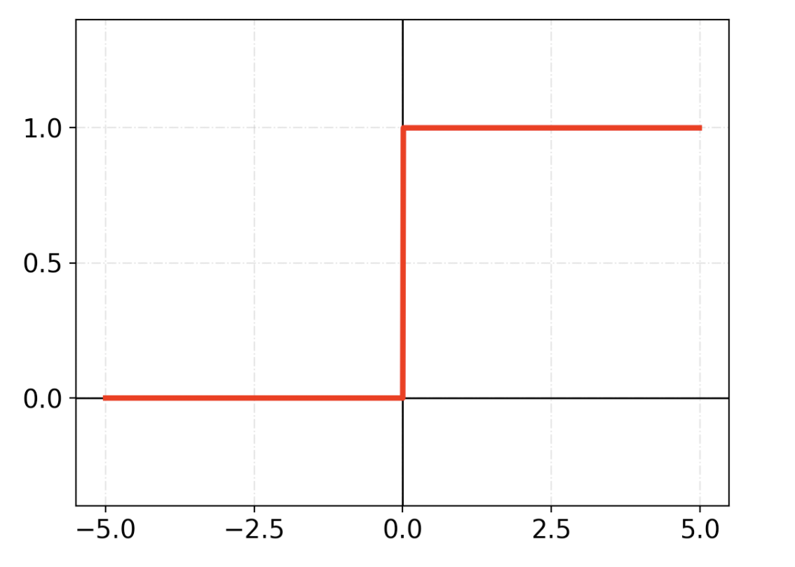
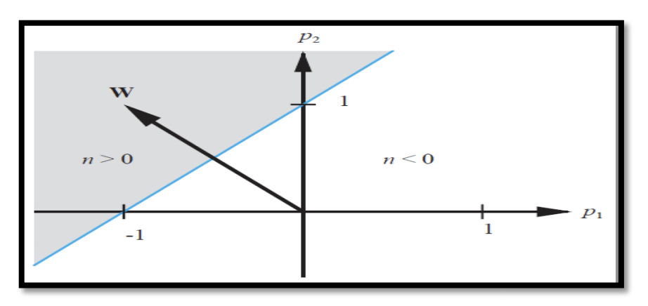

# Perceptron


### Code

pass

### Contents

  * [A Brief History](#a-brief-history)
  * [Overview](#overview)
  * [Simple Pattern Recognitiom](#simple-pattern-recognition)


## A Brief History

pass


## Overview

The single layer, or single neuron  percptron is a FeedForward neural network. Ie, a neural networks where the connections between units do not form a cycle.
Single neuron perceptrons can calssify input vectors into a binary output, because of this, in general a hard limit / binary-step activation function is used.
The hard limit activation function sets the output of the neuron to 0 if the function argument is less than 0, or 1 if the argument is greater than or equal to 0.

The formula can be written as:
```
	       { 1 if x ≧ 0
	f(x) = |
     	       { 0 if x < 0
```
 And it can be visualised like so:





Using this, if we have a two input perceptron it could be written like so:
```
	W₁,₁ = -1
	W₁,₂ = 1

then
	a = hardlim(n)
	a = hardLim(wp+b)
	a = hardlim([-1, 1]p + b)

``` 
It's important to understand what that the W represents the **weight matrix** which can be viwed like so:
```
	    _ 		     _
	    |W₁,₁ W₁,₂ ⋯ W₁,ᵣ|
	W = |W₂,₁ W₂,₂ ⋯ W₂,ᵣ|
	    |  ⋮    ⋮      ⋮ |
	    |W𝙨,₁ W𝙨,₂ ⋯ W𝙨,ᵣ|
	    -		     -
```
A weighted matrix follows two rules:
* The number of rows must equal the number of neurons in the previous layer
* The number of columns must match the number of neurons in the next layer

And b is the **bias**. A bias term allows us to shift neurons activation outputs left and right. This helps us model datasets that do not necessarily pass through the origin.


So given this, if the inner product of the weight matrix with the input vector is greater than or equal to -b, it will be -1. 
This divides the input space into two parts. if b is is equal to -1 we can visualise it like so 



The posiition of the boundry is shifted by changing the value of the bias **(b)**. The line seperating the input space is called the decision boundry which can be seen as the blue line above seperating the shaded region and clear region of the input space.
The shaded region containes all the input vectors for which the output will be 1 and the non-shaded region will be -1 for all other input vectors.
It's important to note that the decision boundry will always be orthogonal to the weight matrix **(W)**

The decision boundry between the two seperated categories can be written as the following wquation:
```
	Wp+b = 0
```

Ultimatly the key property of the single-neuron perceptron is that it can seperate input vectors into two categories.

The downside to this is of course it can ony be used to recognise patterns taht are linearly seperable.


## Simple Pattern Recognitiom


