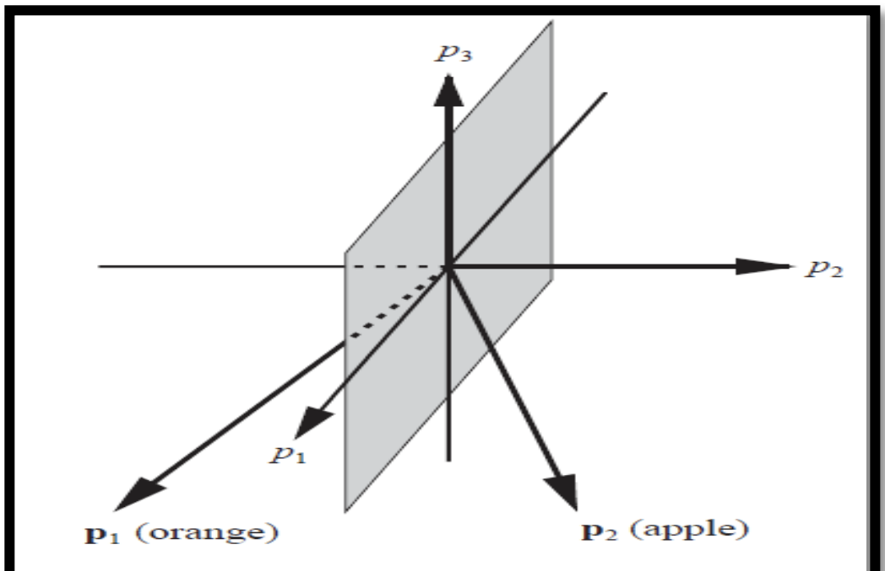

# Perceptron


### Code

pass

### Contents

  * [A Brief History](#a-brief-history)
  * [Overview](#overview)
  * [Simple Pattern Recognition](#simple-pattern-recognition)


## A Brief History

pass


## Overview

The single layer, or single neuron  percptron is a FeedForward neural network. Ie, a neural networks where the connections between units do not form a cycle.
Single neuron perceptrons can calssify input vectors into a binary output, because of this, in general a hard limit / binary-step activation function is used.
The hard limit activation function sets the output of the neuron to 0 if the function argument is less than 0, or 1 if the argument is greater than or equal to 0.

The formula can be written as:
```
	       { 1 if x ≧ 0
	f(x) = |
     	       { 0 if x < 0
```
 And it can be visualised like so:


Using this, if we have a two input perceptron it could be written like so:
```
	W₁,₁ = -1
	W₁,₂ = 1

then
	a = hardlim(n)
	a = hardLim(wp+b)
	a = hardlim([-1, 1]p + b)

``` 
It's important to understand what that the W represents the **weight matrix** which can be viwed like so:
```
	    _ 		     _
	    |W₁,₁ W₁,₂ ⋯ W₁,ᵣ|
	W = |W₂,₁ W₂,₂ ⋯ W₂,ᵣ|
	    |  ⋮    ⋮      ⋮ |
	    |W𝙨,₁ W𝙨,₂ ⋯ W𝙨,ᵣ|
	    -		     -
```
A weighted matrix follows two rules:
* The number of rows must equal the number of neurons in the previous layer
* The number of columns must match the number of neurons in the next layer

And b is the **bias**. A bias term allows us to shift neurons activation outputs left and right. This helps us model datasets that do not necessarily pass through the origin.


So given this, if the inner product of the weight matrix with the input vector is greater than or equal to -b, it will be -1. 
This divides the input space into two parts. if b is is equal to -1 we can visualise it like so 


The posiition of the boundry is shifted by changing the value of the bias **(b)**. The line seperating the input space is called the decision boundry which can be seen as the blue line above seperating the shaded region and clear region of the input space.
The shaded region containes all the input vectors for which the output will be 1 and the non-shaded region will be -1 for all other input vectors.
It's important to note that the decision boundry will always be orthogonal to the weight matrix **(W)**

The decision boundry between the two seperated categories can be written as the following wquation:
```
	Wp+b = 0
```

Ultimatly the key property of the single-neuron perceptron is that it can seperate input vectors into two categories.

The downside to this is of course it can ony be used to recognise patterns taht are linearly seperable.


## Simple Pattern Recognition


To illustrate this further we can use the classic example of using a single layer perceptron to recognise if the object given is an apple or an orange based off of 3 features that out put a +1 or -1 dependant of the outcome.

The features we will be using are:
* Weight
* Shape - round or elliptical
* Texture - smooth or rough 

For instance, if the fruit weighs more than a predetermined amount it will out put 1, less than taht and it will be -1.

For the remainder of this exaple we will use 2 prototype feature vectors for an apple and an orange like so:
```
if
	    | shape |
	p = |texture|
	    |weight |

then our apple will be:

	    | 1 |
	p = |-1 |
	    |-1 |

And our orange will be:

	    | 1 |
	p = | 1 |
	    |-1 | 
```


This means our vector inputs are three dimensional (r=3), so our perceptron equation will be:
```
		    |		     |p₁|     |
	a = hardlims|[W₁,₁ W₁,₂ W₁,₃]|p₂| + b |
		    |		     |p₃|     |
```

Choosing the bias is easy because we want the output to be either a -1 if it's an orange, or +1 if it's an apple.

Next we will need a linear boundry that can seperate our oranges and apples

Using our prototype apple and orange vectors we defined above, we can set our linear boundry to symetrically divide thgem with the p₁, p₃ plane shown below




Since the p₁, p₃ plane is our decision boundry, we can write the equation for it as:
```
	p₂ = 0

or
	       |p₁|
	[0 1 0]|p₂| + 0 = 0
	       |p₃|

```
Therefore the weight matrix and bias will be

* w = [0 1 0]
* b = 0 

The bias is 0 because we pass through the origin. 
W, the weight matrix is orthoginal to the decision boundry and therefore points towards the region that contains the prototype pattern p₂ (apple)

Now we have this set up we can test this by passing some examples. First we can use our prototype examples:

**Orange**
```
  	 	            | 1 |    
	a = hardlim( [0 1 0]|-1 | + 0) = -1 (orange)
		            |-1 |    
```

**Apple**
```
		            | 1 |
	a = hardlim( [0 1 0]| 1 | + 0) = +1 (apple)
			    |-1 | 
```


This seems to be wroking well. But what if we pass in some not-so-perfect fruits?

Lets pass in a misshaped orange where
```
	    |-1|
	p = |-1|
	    |-1|
```

The responce of our perceptron would be:
```
			   |-1|
	a = hardlim([0 1 0]|-1| + 0) = -1(orange)
			   |-1|
```

Again a success. We can in fact input any vectors that are closer to the perfect orange prototype (using Euclidean distance) and it will recognise it as such. The same goes for apples as well.


