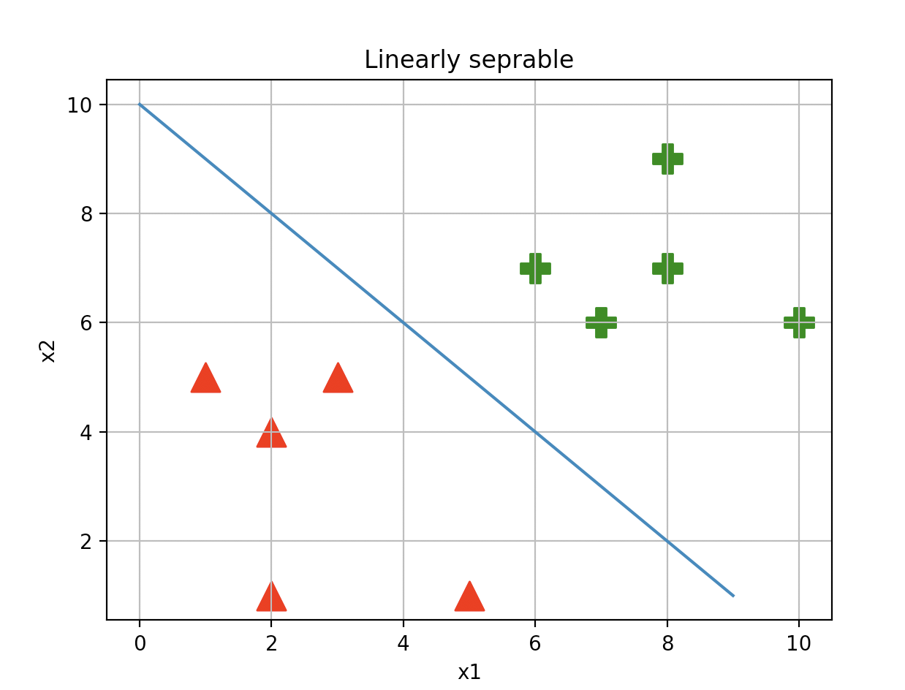
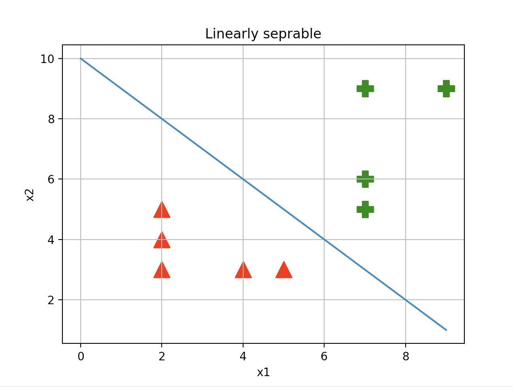
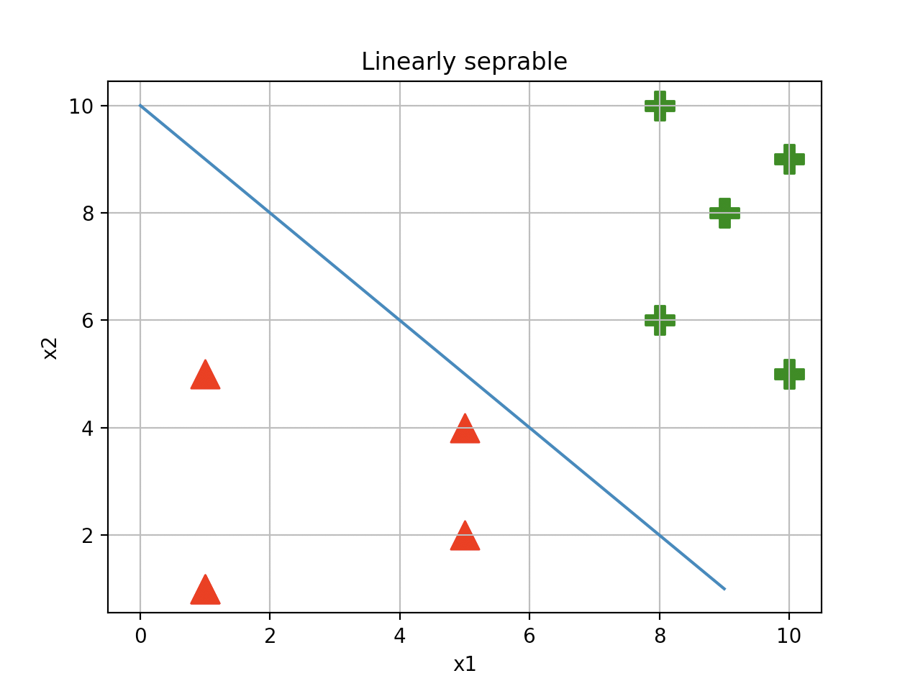

# Solving XOR with a Neural Network

### Contents

  * [The XOR Problem](#the-xor-problem)
  * [Neural Networks](#neural-networks)
  * [Manual Testing](#manual-testing)
  * [Coding and the Learning Algorithm](#coding-and-the-learning-algorithm)

## The XOR Problem

An XOR (exclusive OR gate) is a classic problem in the history of neural network research. 
It is the problem of predicting the outputs of XOR logic gates given two binary inputs.

An XOR logic gate works by giving a true output only when the inputs are different from one another. 
With x1 and x2 being the inputs and y being the output, it works as follows:

| INPUT |      | OUTPUT |
|:-----:|:----:|:------:|
|   x1  |  x2  |    y   |
|   0   |   0  |    0   |
|   0   |   1  |    1   |
|   1   |   0  |    1   |
|   1   |   1  |    0   |

For instance if we feed it [0,0] we will get 0, [0,1] = 1 etc.

Back in the early days of AI research, Marvin Minsky and Seymour Papert proved this could not be solved due to, at the time, only having a single layer neural networks, notibly the perceptron.
 It is noted that this helped towards the _"AI winter"_ of the 1980's where advancements underperformed to expectations leading to a change in the way people thought about AI

The perceptron algorithm (invented 1958 by Frank Rosenblatt) is a linear classifier for binary classification. It is used to decide whether or not an input, represented by a vector of numbers, belongs to some specific class decide whether or not an input, represented by a vector of numbers, belongs to some specific class.
Despite initally seeing very promising, it was quickly proved that perceptrons (at least single layer perceptrons) coulkd not be trained to recognise many classses of paterns. One being the XOR problem.

To visulalise this let's graph it. First lets see some examples of a problem that can be linearly seperated.

