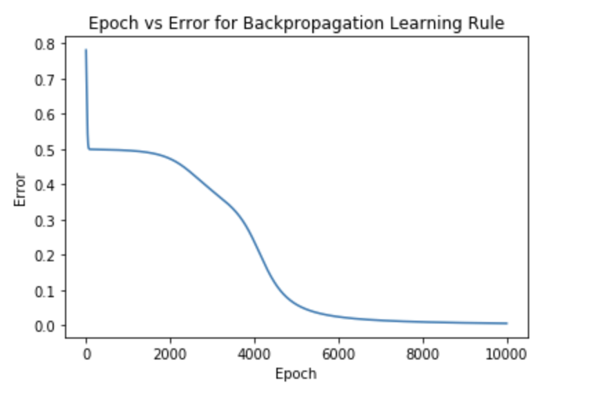
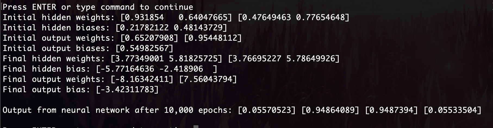

# Solving XOR with a Neural Network


### Contents

  * [The XOR Problem](#the-xor-problem)
  * [Neural Networks](#neural-networks)
  * [Manual Testing](#manual-testing)
  * [Coding the Learning Algorithm](#coding-the-learning-algorithm)
  * [Source](#source)


## The XOR Problem


An XOR (exclusive OR gate) is a classic problem in the history of neural network research. 
It is the problem of predicting the outputs of XOR logic gates given two binary inputs.

An XOR logic gate works by giving a true output only when the inputs are different from one another. 
With x1 and x2 being the inputs and y being the output, it works as follows:

| INPUT |      | OUTPUT |
|:-----:|:----:|:------:|
|   x1  |  x2  |    y   |
|   0   |   0  |    0   |
|   0   |   1  |    1   |
|   1   |   0  |    1   |
|   1   |   1  |    0   |


For instance if we feed it [0,0] we will get 0, [0,1] = 1 etc.

Back in the early days of AI research, Marvin Minsky and Seymour Papert proved this could not be solved due to, at the time, only having a single layer neural networks, notibly the perceptron.
 It is noted that this helped towards the _"AI winter"_ of the 1980's where advancements underperformed to expectations leading to a change in the way people thought about AI

The perceptron algorithm (invented 1958 by Frank Rosenblatt) is a linear classifier for binary classification. It is used to decide whether or not an input, represented by a vector of numbers, belongs to some specific class decide whether or not an input, represented by a vector of numbers, belongs to some specific class.
Despite initally seeing very promising, it was quickly proved that perceptrons (at least single layer perceptrons) coulkd not be trained to recognise many classses of paterns. One being the XOR problem.

To visulalise this let's graph it. First lets see some examples of a problem that can be linearly seperated.

<p align="middle">
  
  
  
</p>

As we can see, a linear classifier solves all of these examples with ease. But what about this one where we use our points from the XOR table?


No linear classifier can solve this. Ie, there is no straight line that can serperate this data.

We'll need to train a neural network to classify the input patterns accordingly and seperate this data using decision boundries.

It's good to note that the type of decision boundry that the neural network can learn is determined by the number of hidden layers the network has. If there are no hiffen layers, like in the case of the single layer perceptron, then it can only learn linear problems.


## Neural Networks


A basic neural network with one hidden layer looks like this 


This is a basic neural network that has a single layer. neural networks can get a lot more complicated than this one but this is perfect for our XOR problem.

if we apply our problem to the above neural network, it looks like this


* Input = (x₁, x₂)
* Hidden layer = (h₁, h₂)
* Output layer = (y)
* Weights for h1 (hidden layer) = (20, 20)
* Weights for h2 (hidden layer) = (-20, -20)
* Bias for h1 = (-10)
* Bias for h2 = (30)
* Weights for output (y) = (20, 20)
* Bias for output (y) = (-30)


Note that for this initial demonstration we selected the values of our weights and biases knowing they will produce the desired outcome.
 In reality we start with random values an iterate until conversion, which we will see in the coding implementation section next.

But first, let's test this neural network by manually running through it with our pre-selected values.

## Manual Testing


So the initial inputs from our XOR problem are as follows
```
	[0, 0]
	[0, 1]
	[1, 0]
	[1, 1]
```

We will insert each of these into the neural network by passing them to the inputs one by one. The neurons in the network will be using the sigmoid function because it's a continuious functin that outputs avalue between 0 - 1

```
Sigmoid = σ()

	[0,0] = σ(20*0+20*0-10) ≈ 0 ; σ(-20*0-20*0+30) ≈ 1 ; σ(20*0+20*1-30) ≈ 0
	[1,1] = σ(20*1+20*1-10) ≈ 1 ; σ(-20*1-20*1+30) ≈ 0 ; σ(20*1+20*0-30) ≈ 0
	[0,0] = σ(20*0+20*1-10) ≈ 0 ; σ(-20*0-20*1+30) ≈ 1 ; σ(20*1+20*1-30) ≈ 1
	[0,0] = σ(20*1+20*0-10) ≈ 0 ; σ(-20*1-20*0+30) ≈ 1 ; σ(20*1+20*1-30) ≈ 1
```

As we can see from the outputs it works. Remember the rules of XOR are, if the parameteres are different we get back a possitive (1), else negative (0).

So from our algorithm, when we passed our inputs, we got these outputs
```
	[0,0] ≈ 0
	[1,1] ≈ 0
	[0,1] ≈ 1
	[1,0] ≈ 1
```

So what this is doing is, if we look at the first neuron (h₁), it's performing a logical OR by outputinga 1 whenever at least one of the inputs is a 1.
The second neuron (h₂) is like the flipside of a logical OR, it outputs a 1 as long as one of the units is a 0, else it will ouput a 1.
And (y) is basically doing an AND, it wants both inputs to be on for the output to be on. If they are both 1 we get back a 1, else 0.


So thats the logic behind solving XOR with a neural network. Another way to think about it is; Remember each one of the units is a logistic unit and a unit has a hyperplane associated with it.
Now, what would a hyperplane for (h₁) look like?
Well, if we use the same values from earlier to visualise this, 20 + 20 - 10, it would go through [1,1], but the bias is a little smaller, so it offsets the hyperplane pulling it a little to the left like so


And now if we add the hyperplane for (h₂)


So what this classifier is doing is putting two hyperplanes into the space, and (y) is looking for an intersection of these hyperplanes.

This is obviously a very basic introduction to neural networks but it's an important one. Historically it was a huge breakthrough in the development of AI, thus this is a very powerful idea. It means whatever region of space the positives occupy, we can bracket them with hyperplanes and combine them together to learn the decision boundry however complicated it might be.

Now we have a solid understanding of basic nerual networks and how to use them to solve XOR, let's impliment one using Python.


## Coding the Learning Algorithm

The idea behind the code for this is for it to update it's weights accordingly and eventually converge on the expected output. 
It updates it's weights and biases based on the loss function. 
we will be using the _square error_ loss function for this. 
As mentioned earlier, the weights and biases are initially set randomly

Each iteration will consist of three parts. First we compute the predicted output using the sigmoid function, secondly we compute the loss using square error loss, then we update the weights by (w(new) = w(old) - 𝞪∆w) and then the bias (B(new) = B(old) - 𝞪∆w).
 And we continue this until convergence.

The algorithm can be thought of as divided into two sections. The forward pass and the backwards pass, also known as backpropergation.


**The forward pass**

First let's import numpy and set up our input values and the expected output values as defined in the XOR table
```
import numpy as np


inputs = np.array([[0, 0], [1, 1], [0, 1], [1, 0]])
expected_outputs = np.array([[0], [1], [1], [0]])
```

We also need to set the epochs (number of iterations) and learning rate

```
epochs = 10000
learning_rate = 0.1
```

Next we can set the size of our layers and initialize the weights and biases with random values

```
input_layer_neurons, hidden_layer_neurons, output_layer = 2, 2, 1

hidden_weights = np.random.uniform(size=(input_layer_neurons, hidden_layer_neurons))
hidden_bias = np.random.uniform(size=(1, hidden_layer_neurons))

output_weights = np.random.uniform(size=(hidden_layer_neurons, output_layer_neurons))
output_bias = np.random.uniform(size=(1, output_layer_neurons))
```

Next, we want to define our sigmoid function. Sigmoid is calculated as
```
		1
	y = -------------
	    1+e^(∑w₁x₁+b)

Where (∑w₁x₁+b) os known as the activation function
```

So we write a function to execute this for us
```
	def sigmoid(x):
		return 1/(1+np.exp(-x))
```

And we can use this to update our weights and biases by calling their calculation inside of the sigmoid function, like so

```
# hidden layer
hidden_layer_activation = np.dot(inputs, hidden_weights)
hidden_layer_activation += hidden_bias
hidden_layer_output = sigmoid(hidden_layer_activation)

# Output layer
output_layer_activation = np.dot(hidden_layer_output, output_weights)
output_layer_activation += output_bias
predicted_output = sigmoid(output_layer_activation)
```

And this predicted output will be compared to the expected output. That makes one complete forward pass. If it is not the same as the expected output, we will update our weights and biases accourdingly using backpropergation.

Backpropergation is able to do this because it computes the gradient of the loss function (square error loss in our case) with respect to the weights. 
Basically it sees how far off the predicted value is from our expected result and penalizes the result, which it uses to update the weights and biases accourdingly. The idea is to get the loss as minimal as possible because that signifies we are close to our prediction.
The whole operation is called gradient decent which we covered already in this repo in detail [here](https://github.com/369geofreeman/machine-learning-algorithms-and-data-structures/tree/main/Machine-Learning-Algorithms/gradient-decent)


Now we can add backpropergation to our algorithm


**The backwards Pass**


First we will want our sigmoid_derivative function
```
	def sigmoid_derivative(x):
		return x * (1-x)
```
now we are all set to add backpropergation

``

# Bacpropergation
error = expected_output - predicted_output
d_predicted_output = error * sigmoid_derivative(predicted_output)

error_hidden_layer = d_predicted_output.dot(output_weights.T)
d_hidden_layer = error_hidden_layer * sigmoid_derivative(hidden_layer_output)

# Updating weights & biasis
output_weights += hidden_layer_output.T.dot(d_predicted_output) * learning_rate
outPut_bias += np.sum(d_predicted_output, axis=0, keepdims=True) * learning_rate
hidden_weights += inputs.T.dot(d_hidden_layer) * learning_rate
hidden_bias += np.sum(d_hidden_layer, axis=0, keepdims=True) * learning_rate
```

The proces is repeated until conversion (when predicted_output = expected_output). We normally set an epoch (number of iterations) instead of waiting for perfect conversion because as it gets close, to the prediction, the step sizes are so small we can just say they are correct

We want to find the right balance for our epochs and learning rate, and this is something that takes a little trial and error to fine tune.

We have set these to:

* epochs = 10000
* learnig_rate = 0.1

Which shows the cost function is working very well as it finds conversion




which seems to be effective enough




The result showing: _Output from neural network after 10,000 epochs: [0.05570523] [0.94864089] [0.9487394] [0.05533504]_ which is close enough to [0, 1, 1, 0] to say this was a successful run.

The full code can be found [here]()


## Source

[Victor Lavrenko](https://www.youtube.com/channel/UCs7alOMRnxhzfKAJ4JjZ7Wg)
[Wikipedia](https://en.wikipedia.org/wiki/XOR_gate)
[Siddhartha Dutta](https://medium.com/@siddharthapdutta)


