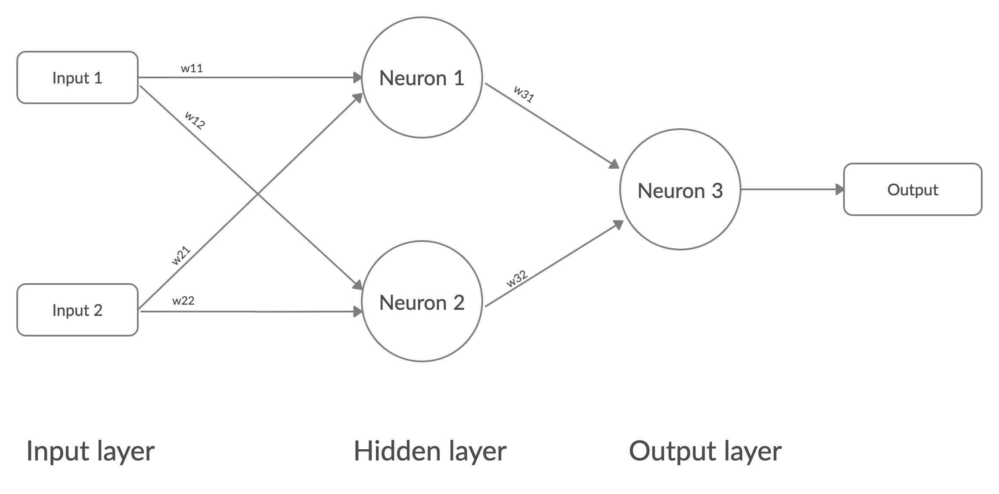

# Solving XOR with a Neural Network

### Contents

  * [The XOR Problem](#the-xor-problem)
  * [Neural Networks](#neural-networks)
  * [Manual Testing](#manual-testing)
  * [Coding and the Learning Algorithm](#coding-and-the-learning-algorithm)

## The XOR Problem

An XOR (exclusive OR gate) is a classic problem in the history of neural network research. 
It is the problem of predicting the outputs of XOR logic gates given two binary inputs.

An XOR logic gate works by giving a true output only when the inputs are different from one another. 
With x1 and x2 being the inputs and y being the output, it works as follows:

| INPUT |      | OUTPUT |
|:-----:|:----:|:------:|
|   x1  |  x2  |    y   |
|   0   |   0  |    0   |
|   0   |   1  |    1   |
|   1   |   0  |    1   |
|   1   |   1  |    0   |

For instance if we feed it [0,0] we will get 0, [0,1] = 1 etc.

Back in the early days of AI research, Marvin Minsky and Seymour Papert proved this could not be solved due to, at the time, only having a single layer neural networks, notibly the perceptron.
 It is noted that this helped towards the _"AI winter"_ of the 1980's where advancements underperformed to expectations leading to a change in the way people thought about AI

The perceptron algorithm (invented 1958 by Frank Rosenblatt) is a linear classifier for binary classification. It is used to decide whether or not an input, represented by a vector of numbers, belongs to some specific class decide whether or not an input, represented by a vector of numbers, belongs to some specific class.
Despite initally seeing very promising, it was quickly proved that perceptrons (at least single layer perceptrons) coulkd not be trained to recognise many classses of paterns. One being the XOR problem.

To visulalise this let's graph it. First lets see some examples of a problem that can be linearly seperated.

  
  
  

As we can see, a linear classifier solves all of these examples with ease. But what about this one where we use our points from the XOR table?

No linear classifier can solve this. Ie, there is no straight line that can serperate this data.

We'll need to train a neural network to classify the input patterns accordingly and seperate this data using decision boundries.

It's good to note that the type of decision boundry that the neural network can learn is determined by the number of hidden layers the network has. If there are no hiffen layers, like in the case of the single layer perceptron, then it can only learn linear problems.

## Neural Networks

A basic neural network with one hidden layer looks like this 

This is a basic neural network that has a single layer. neural networks can get a lot more complicated than this one but this is perfect for our XOR problem.

if we apply our problem to the above neural network, it looks like this

* Input = (x₁, x₂)
* Hidden layer = (h₁, h₂)
* Output layer = (y)
* Weights for h1 (hidden layer) = (20, 20)
* Weights for h2 (hidden layer) = (-20, -20)
* Bias for h1 = (-10)
* Bias for h2 = (30)
* Weights for output (y) = (20, 20)
* Bias for output (y) = (-30)

